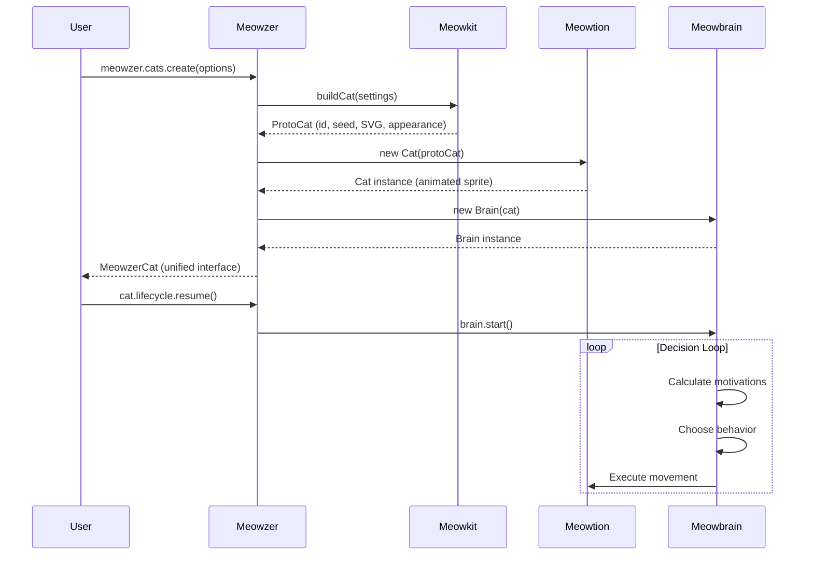

# Meowzer

A complete system for creating autonomous, animated cats on the web.

## 🏗️ System Architecture

```mermaid
graph TB
    subgraph "User Interface"
        USER[Developer/User]
    end

    subgraph "High-Level API"
        SDK[Meowzer SDK<br/>Integration Layer]
    end

    subgraph "Core Libraries"
        MEOWKIT[Meowkit<br/>Cat Creation]
        MEOWTION[Meowtion<br/>Animation & Movement]
        MEOWBRAIN[Meowbrain<br/>AI Behavior]
        MEOWBASE[Meowbase<br/>IndexedDB Storage]
    end

    subgraph "Data"
        PROTOCAT[ProtoCat<br/>Cat Definition]
        CAT[Cat Instance<br/>Animated Sprite]
        BRAIN[Brain Instance<br/>Decision Engine]
    end

    USER -->|meowzer.cats.create()| SDK

    SDK -->|buildCat| MEOWKIT
    SDK -->|animateCat| MEOWTION
    SDK -->|createBrain| MEOWBRAIN
    SDK -->|save/load| MEOWBASE

    MEOWKIT -->|generates| PROTOCAT
    MEOWTION -->|creates| CAT
    MEOWBRAIN -->|creates| BRAIN

    PROTOCAT -->|used by| MEOWTION
    CAT -->|controlled by| BRAIN

    MEOWBASE -->|stores| PROTOCAT

    style SDK fill:#ff9500
    style MEOWKIT fill:#4a9eff
    style MEOWTION fill:#50c878
    style MEOWBRAIN fill:#da70d6
    style MEOWBASE fill:#ffd700
```

## 📦 Packages

### SDK (Meowzer)

High-level API that orchestrates all libraries. Provides a class-based interface for cat creation and management.

**Key Features:**

- Unified `Meowzer` class with manager pattern
- Cat lifecycle management via `meowzer.cats` manager
- Storage operations via `meowzer.storage` manager
- Interaction system via `meowzer.interactions` manager
- Plugin system for extensibility

### Meowkit (Cat Creation)

Transforms user settings into structured cat data with SVG sprites.

**Key Features:**

- Procedural pixel-art SVG generation
- Seed-based cat serialization (shareable cat codes)
- Builder pattern for controlled creation
- Zero dependencies for sprite generation

### Meowtion (Animation & Movement)

Brings cat sprites to life with animations and physics.

**Key Features:**

- GSAP-based state animations (idle, walking, running, sitting, sleeping, playing)
- Smooth movement with curved path following
- Physics simulation (velocity, friction, boundaries)
- Modular architecture (DOM, movement, physics modules)

### Meowbrain (AI Behavior)

Autonomous decision-making for lifelike cat behavior.

**Key Features:**

- Personality-driven behavior (6 presets: lazy, playful, curious, aloof, energetic, balanced)
- Motivation system (rest, stimulation, exploration)
- 5 behavior types (wandering, resting, playing, observing, exploring)
- Decision engine with weighted behavior selection

### Meowbase (IndexedDB Storage)

Document database for persisting cat collections.

**Key Features:**

- Document-based collections stored in IndexedDB
- LRU cache with automatic eviction
- Full CRUD operations for collections and cats
- Sample dataset for learning and demos
- Result pattern for consistent error handling

## 🚀 Quick Start

```typescript
// Initialize Meowzer
import { Meowzer } from "meowzer";

const meowzer = new Meowzer();
await meowzer.init();

// Simple: Create a random cat
const cat = await meowzer.cats.create();
// Cat automatically appears on the page!

// Advanced: Full control
const customCat = await meowzer.cats.create({
  name: "Whiskers",
  description: "A playful orange tabby",
  settings: {
    color: "#FF9500",
    eyeColor: "#00FF00",
    pattern: "tabby",
    size: "medium",
    furLength: "short",
  },
});

// Set personality
customCat.setPersonality("playful");

// Management
const allCats = meowzer.cats.getAll();
await meowzer.cats.destroyAll(); // Clean up when done
```

## 📊 Data Flow



## 🗂️ Repository Structure

````
meowzer/
├── meowzer/                  # Monorepo root for packages
│   ├── meowkit/             # Cat creation library
│   │   ├── builder.ts
│   │   ├── validation.ts
│   │   ├── serialization.ts
│   │   ├── svg-generator.ts
│   │   └── color-utils.ts
│   ├── meowtion/            # Animation library
│   │   ├── cat.ts
│   │   ├── state-machine.ts
│   │   ├── animations/
│   │   └── cat/
│   │       ├── dom.ts
│   │       ├── movement.ts
│   │       └── physics.ts
│   ├── meowbrain/           # AI behavior library
│   │   ├── brain.ts
│   │   ├── decision-engine.ts
│   │   ├── behaviors.ts
│   │   ├── personality.ts
│   │   └── behavior-orchestrator.ts
│   ├── meowbase/            # IndexedDB storage
│   │   ├── meowbase.ts
│   │   ├── collections/
│   │   ├── cats/
│   │   └── storage/
│   ├── sdk/                 # Integration layer (package: "meowzer")
│   │   ├── meowzer-sdk.ts
│   │   ├── meowzer-cat.ts
│   │   ├── managers/
│   │   │   ├── cat-manager.ts
│   │   │   ├── storage-manager.ts
│   │   │   ├── interaction-manager.ts
│   │   │   └── hook-manager.ts
│   │   ├── interactions/
│   │   └── cat-modules/
│   ├── ui/                  # Web components library
│   │   ├── components/
│   │   ├── providers/
│   │   └── controllers/
│   ├── types/               # Shared TypeScript types
│   └── utilities/
│       └── event-emitter.ts # Shared event system
├── docs/                    # Documentation website (Astro + Starlight)
│   └── src/
│       └── content/
├── demo/                    # Demo website (Astro)
└── meta/                    # Project documentation
    └── *.md

## 🛠️ Development

### Initial Setup

From the root directory:

```bash
npm install  # Installs all dependencies using npm workspaces
````

### Running Tests

Each package has its own test suite:

```bash
cd meowzer/meowkit && npm test
cd meowzer/meowtion && npm test
cd meowzer/meowbrain && npm test
cd meowzer/meowbase && npm test
cd meowzer/meowzer && npm test
```

### Running the Docs Site

```bash
cd docs
npm run dev      # Start dev server at http://localhost:5173
npm run build    # Build for production
npm run preview  # Preview production build
```

## � Documentation

Each package has comprehensive documentation:

- **[Meowkit README](./meowzer/meowkit/README.md)** - Cat creation API, seed format, builder pattern
- **[Meowtion README](./meowzer/meowtion/README.md)** - Animation system, movement, state machine
- **[Meowbrain README](./meowzer/meowbrain/README.md)** - AI behaviors, personalities, decision engine
- **[Meowbase README](./meowzer/meowbase/README.md)** - Storage API, collections, result pattern- **[SDK README](./meowzer/sdk/README.md)** - High-level API, managers, configuration
- **[UI README](./meowzer/ui/README.md)** - Web components, providers, playground
- **[Documentation Site](./docs/)** - Astro + Starlight docs site

## 🎯 Use Cases

- **Interactive Websites**: Add autonomous cats to engage visitors
- **Games**: Create cat characters with unique personalities
- **Learning Tool**: Study AI decision-making and animation systems
- **Art Projects**: Generate and share unique cat designs via seeds
- **Demos**: Showcase web technologies (IndexedDB, SVG, animations)

## 🏛️ Architecture Principles

1. **Modular Design**: Each library has a single, focused responsibility
2. **Layered Abstraction**: Low-level libraries (Meowkit) → High-level API (Meowzer)
3. **Type Safety**: Full TypeScript with comprehensive type definitions
4. **Zero Config**: Sensible defaults, optional customization
5. **Event-Driven**: Shared EventEmitter for reactive programming
6. **Testable**: Pure functions, dependency injection, comprehensive tests

## � Workspace Commands

The root `package.json` provides convenient scripts:

- `npm run dev:docs` - Start docs development server
- `npm run build:docs` - Build docs for production
- `npm run dev:demo` - Start demo development server
- `npm run build:demo` - Build demo for production
- `npm run build:sdk` - Build SDK package
- `npm run build:ui` - Build UI components package
- `npm run build` - Build both SDK and UI packages

## 📖 Documentation

- **Meowkit:** See [meowzer/meowkit/README.md](./meowzer/meowkit/README.md)
- **Meowtion:** See [meowzer/meowtion/README.md](./meowzer/meowtion/README.md)
- **Meowbrain:** See [meowzer/meowbrain/README.md](./meowzer/meowbrain/README.md)
- **Meowbase:** See [meowzer/meowbase/README.md](./meowzer/meowbase/README.md)
- **SDK:** See [meowzer/sdk/README.md](./meowzer/sdk/README.md)
- **UI:** See [meowzer/ui/README.md](./meowzer/ui/README.md)
- **Documentation Site:** [docs/](./docs/) - Astro + Starlight

## 🧪 Testing

Each package has its own test suite using Vitest:

```bash
cd meowzer/meowkit && npm test
cd meowzer/meowtion && npm test
cd meowzer/meowbrain && npm test
cd meowzer/meowbase && npm test
cd meowzer/sdk && npm test
cd meowzer/ui && npm test
```

## 📝 License

MIT
