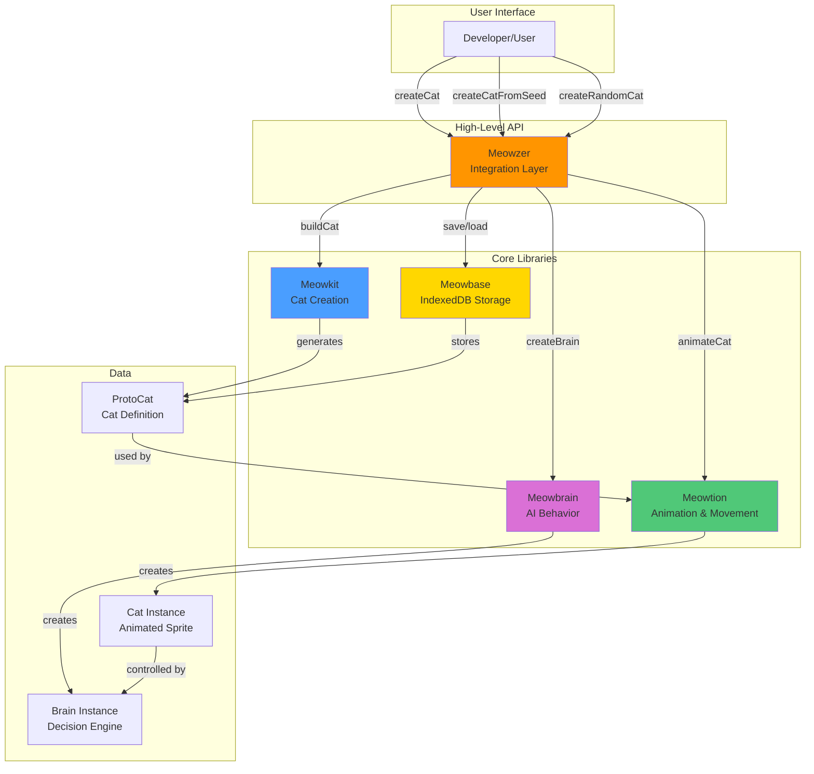
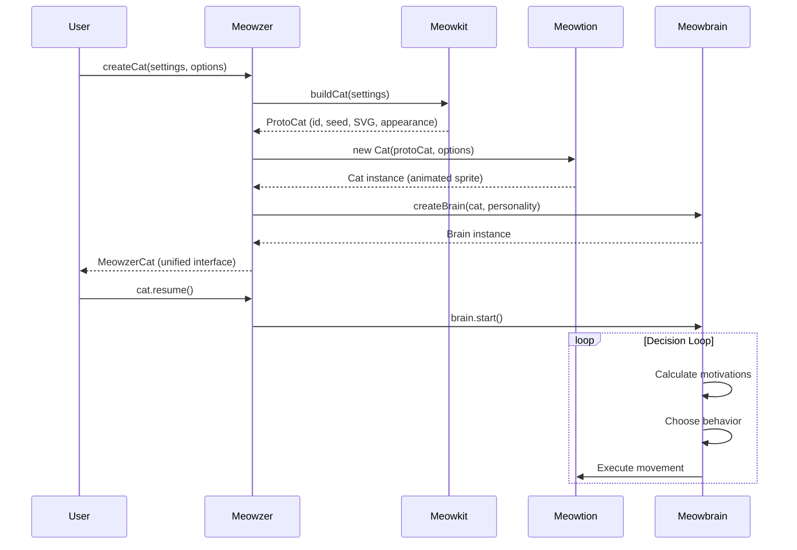

# Meowzer

A complete system for creating autonomous, animated cats on the web.

## 🏗️ System Architecture



## 📦 Packages

### Meowzer (Integration Layer)

High-level API that orchestrates all libraries. Simplifies cat creation and management.

**Key Features:**

- One-line cat creation with `createCat()`, `createCatFromSeed()`, `createRandomCat()`
- Automatic lifecycle management and cleanup
- Global cat registry and management functions
- Database persistence integration

### Meowkit (Cat Creation)

Transforms user settings into structured cat data with SVG sprites.

**Key Features:**

- Procedural pixel-art SVG generation
- Seed-based cat serialization (shareable cat codes)
- Builder pattern for controlled creation
- Zero dependencies for sprite generation

### Meowtion (Animation & Movement)

Brings cat sprites to life with animations and physics.

**Key Features:**

- GSAP-based state animations (idle, walking, running, sitting, sleeping, playing)
- Smooth movement with curved path following
- Physics simulation (velocity, friction, boundaries)
- Modular architecture (DOM, movement, physics modules)

### Meowbrain (AI Behavior)

Autonomous decision-making for lifelike cat behavior.

**Key Features:**

- Personality-driven behavior (6 presets: lazy, playful, curious, aloof, energetic, balanced)
- Motivation system (rest, stimulation, exploration)
- 5 behavior types (wandering, resting, playing, observing, exploring)
- Decision engine with weighted behavior selection

### Meowbase (IndexedDB Storage)

Document database for persisting cat collections.

**Key Features:**

- Document-based collections stored in IndexedDB
- LRU cache with automatic eviction
- Full CRUD operations for collections and cats
- Sample dataset for learning and demos
- Result pattern for consistent error handling

## 🚀 Quick Start

```typescript
// Simple: Create one autonomous cat
import { createRandomCat } from "@meowzer/meowzer";

const cat = createRandomCat(); // That's it!

// Advanced: Full control
import { createCat } from "@meowzer/meowzer";

const cat = createCat(
  {
    color: "#FF9500",
    eyeColor: "#00FF00",
    pattern: "tabby",
    size: "medium",
    furLength: "short",
  },
  {
    name: "Whiskers",
    personality: "playful",
    position: { x: 100, y: 100 },
    boundaries: { minX: 0, maxX: 800, minY: 0, maxY: 600 },
  }
);

// Management
import { getAllCats, destroyAllCats } from "@meowzer/meowzer";

const allCats = getAllCats();
destroyAllCats(); // Clean up when done
```

## 📊 Data Flow



## 🗂️ Repository Structure

````
meowzer/
├── meowzer/                  # Monorepo root for packages
│   ├── meowkit/             # Cat creation library
│   │   ├── builder.ts
│   │   ├── validation.ts
│   │   ├── serialization.ts
│   │   ├── svg-generator.ts
│   │   └── color-utils.ts
│   ├── meowtion/            # Animation library
│   │   ├── cat.ts
│   │   ├── animator.ts
│   │   ├── state-machine.ts
│   │   ├── animations/
│   │   └── cat/
│   │       ├── dom.ts
│   │       ├── movement.ts
│   │       └── physics.ts
│   ├── meowbrain/           # AI behavior library
│   │   ├── brain.ts
│   │   ├── decision-engine.ts
│   │   ├── behaviors.ts
│   │   ├── personality.ts
│   │   └── builder.ts
│   ├── meowbase/            # IndexedDB storage
│   │   ├── meowbase.ts
│   │   ├── collections/
│   │   ├── cats/
│   │   └── storage/
│   ├── meowzer/             # Integration layer
│   │   ├── meowzer.ts
│   │   ├── creation.ts
│   │   ├── management.ts
│   │   ├── database.ts
│   │   └── meowzer-cat.ts
│   └── utilities/
│       └── event-emitter.ts # Shared event system
├── docs/                    # Documentation website
│   └── source/
│       ├── components/
│       └── content/
└── meta/                    # Project documentation
    └── project-docs-revamp.md

## 🛠️ Development

### Initial Setup

From the root directory:

```bash
npm install  # Installs all dependencies using npm workspaces
````

### Running Tests

Each package has its own test suite:

```bash
cd meowzer/meowkit && npm test
cd meowzer/meowtion && npm test
cd meowzer/meowbrain && npm test
cd meowzer/meowbase && npm test
cd meowzer/meowzer && npm test
```

### Running the Docs Site

```bash
cd docs
npm run dev      # Start dev server at http://localhost:5173
npm run build    # Build for production
npm run preview  # Preview production build
```

## � Documentation

Each package has comprehensive documentation:

- **[Meowkit README](./meowzer/meowkit/README.md)** - Cat creation API, seed format, builder pattern
- **[Meowtion README](./meowzer/meowtion/README.md)** - Animation system, movement, state machine
- **[Meowbrain README](./meowzer/meowbrain/README.md)** - AI behaviors, personalities, decision engine
- **[Meowbase README](./meowzer/meowbase/README.md)** - Storage API, collections, result pattern

## 🎯 Use Cases

- **Interactive Websites**: Add autonomous cats to engage visitors
- **Games**: Create cat characters with unique personalities
- **Learning Tool**: Study AI decision-making and animation systems
- **Art Projects**: Generate and share unique cat designs via seeds
- **Demos**: Showcase web technologies (IndexedDB, SVG, animations)

## 🏛️ Architecture Principles

1. **Modular Design**: Each library has a single, focused responsibility
2. **Layered Abstraction**: Low-level libraries (Meowkit) → High-level API (Meowzer)
3. **Type Safety**: Full TypeScript with comprehensive type definitions
4. **Zero Config**: Sensible defaults, optional customization
5. **Event-Driven**: Shared EventEmitter for reactive programming
6. **Testable**: Pure functions, dependency injection, comprehensive tests

## 📝 License

MIT License - See LICENSE file for details

## 🔧 Workspace Commands

The root `package.json` provides convenient scripts for working with both projects:

- `npm test` - Run Meowbase tests
- `npm run test:watch` - Run Meowbase tests in watch mode
- `npm run test:ui` - Open Vitest UI for Meowbase
- `npm run test:coverage` - Generate test coverage report
- `npm run dev:docs` - Start docs development server
- `npm run build:docs` - Build docs for production

## 📖 Documentation

- **Meowbase Library:** See [meowbase/README.md](./meowbase/README.md)
- **API Reference:** See [meowbase/README.md#api-reference](./meowbase/README.md#api-reference)
- **Architecture:** See [meowbase/README.md#architecture](./meowbase/README.md#architecture)

## 🧪 Testing

All tests are located in the `/meowbase/__tests__/` directory. The test suite uses:

- **Vitest** for the test runner
- **happy-dom** for simulating browser APIs in Node.js

Current test coverage:

- ✅ Cache tests (20 tests)
- 🚧 IndexedDB storage tests (pending - requires fake-indexeddb)
- 🚧 Collection operations tests (pending)
- 🚧 Cat operations tests (pending)

## 📝 License

MIT
