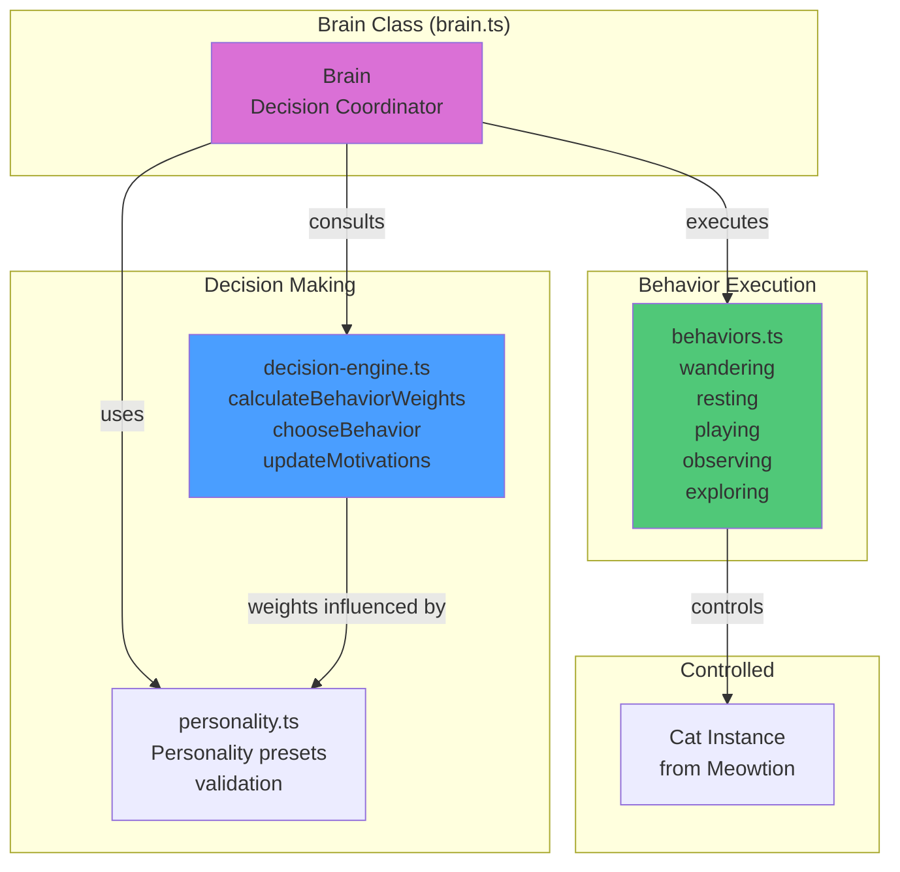

# Meowbrain

Artificial intelligence library for autonomous cat behavior and decision-making.

## Overview

Meowbrain gives cats "brains" - autonomous behavior systems that control `Cat` instances from Meowtion. Instead of users directly controlling cats, Meowbrain makes cats act independently based on personality traits, environmental stimuli, and decision-making algorithms. This creates lifelike, unpredictable behavior that makes cats feel alive.

## Module Architecture



## Decision Loop Flow

```mermaid
flowchart TD
    START([Brain.start]) --> WAIT[Wait random interval<br/>2-5 seconds]
    WAIT --> UPDATE[Update Motivations<br/>rest += 0.001/sec<br/>stimulation += 0.002/sec<br/>exploration += 0.0015/sec]

    UPDATE --> CALC[Calculate Behavior Weights<br/>decision-engine.ts]

    CALC --> W_WANDER[Wandering Weight<br/>= energy × curiosity × exploration]
    CALC --> W_REST[Resting Weight<br/>= rest × (1 - energy)]
    CALC --> W_PLAY[Playing Weight<br/>= playfulness × stimulation × energy]
    CALC --> W_OBSERVE[Observing Weight<br/>= curiosity × (1 - playfulness)]
    CALC --> W_EXPLORE[Exploring Weight<br/>= exploration × curiosity]

    W_WANDER --> CHOOSE{Choose Behavior<br/>Weighted Random}
    W_REST --> CHOOSE
    W_PLAY --> CHOOSE
    W_OBSERVE --> CHOOSE
    W_EXPLORE --> CHOOSE

    CHOOSE -->|selected| EXECUTE[Execute Behavior<br/>behaviors.ts]

    EXECUTE --> B_WANDER[wandering:<br/>curved path to random point]
    EXECUTE --> B_REST[resting:<br/>sit/sleep in place]
    EXECUTE --> B_PLAY[playing:<br/>zigzag movements]
    EXECUTE --> B_OBSERVE[observing:<br/>sit and watch]
    EXECUTE --> B_EXPLORE[exploring:<br/>move to unvisited area]

    B_WANDER --> CONTROL[Control Cat via<br/>cat.moveTo / cat.setState]
    B_REST --> CONTROL
    B_PLAY --> CONTROL
    B_OBSERVE --> CONTROL
    B_EXPLORE --> CONTROL

    CONTROL --> MEMORY[Update Memory<br/>visited positions<br/>behavior history]

    MEMORY --> CHECK{Brain Running?}
    CHECK -->|Yes| WAIT
    CHECK -->|No| STOP([Brain.stop])

    style START fill:#50c878
    style CHOOSE fill:#da70d6
    style EXECUTE fill:#4a9eff
    style STOP fill:#ff6b6b
```

## Core Concepts

### Brain Class

A brain controls a single cat and makes autonomous decisions:

```typescript
class Brain {
  readonly id: string;
  readonly cat: Cat;

  // Getters
  get personality(): Personality;
  get state(): BrainState;
  get memory(): Memory;
  get isRunning(): boolean;

  // Lifecycle
  start(): void;
  stop(): void;
  destroy(): void;

  // Configuration
  setPersonality(
    personality: Partial<Personality> | PersonalityPreset
  ): void;
  setEnvironment(environment: Environment): void;

  // Events
  on(event: BrainEvent, handler: EventHandler): void;
  off(event: BrainEvent, handler: EventHandler): void;
}
```

### Type Definitions

```typescript
interface BrainState {
  currentBehavior: BehaviorType;
  motivation: Motivation;
  lastDecisionTime: number;
  decisionCooldown: number;
}

type BehaviorType =
  | "wandering" // Random movement with curved paths
  | "resting" // Sitting or sleeping
  | "playing" // Erratic, playful movements
  | "observing" // Sitting and watching
  | "exploring"; // Moving to unvisited areas

type BrainEvent =
  | "behaviorChange" // Emitted when behavior changes
  | "decisionMade" // Emitted when decision is made
  | "reactionTriggered"; // Emitted on reactions (boundary hits, etc.)

type EventHandler = (data?: any) => void;

interface Personality {
  energy: number; // 0-1: High = more active, low = more rest
  curiosity: number; // 0-1: How likely to explore
  playfulness: number; // 0-1: Frequency of playful behaviors
  independence: number; // 0-1: Ignores vs reacts to stimuli
  sociability: number; // 0-1: Attraction to other cats/elements
}

type PersonalityPreset =
  | "lazy" // Low energy, high rest frequency
  | "playful" // High playfulness and energy
  | "curious" // High curiosity, explores boundaries
  | "aloof" // High independence, ignores stimuli
  | "energetic" // High energy, constant movement
  | "balanced"; // Medium values across all traits

interface Motivation {
  rest: number; // 0-1: Need to rest (increases over time)
  stimulation: number; // 0-1: Need for activity (increases when idle)
  exploration: number; // 0-1: Desire to explore new areas
}

interface Memory {
  visitedPositions: Position[]; // Recently visited locations
  lastInteractionTime: number; // Last stimulus reaction
  boundaryHits: number; // Recent boundary collisions
  previousBehaviors: BehaviorType[]; // Recent behavior history
}

interface Environment {
  boundaries: Boundaries; // Movement constraints
  obstacles?: Obstacle[]; // Things to avoid
  attractors?: Attractor[]; // Things to approach
  otherCats?: Cat[]; // Other cats to interact with
}
```

## API Reference

### Creating Brains

#### `createBrain(cat: Cat, options?: BrainOptions): Brain`

Creates a brain for a cat, enabling autonomous behavior.

```typescript
import { animateCat } from "@meowzer/meowtion";
import { createBrain } from "@meowzer/meowbrain";

const cat = animateCat(protoCat);
const brain = createBrain(cat, {
  personality: "playful",
  environment: {
    boundaries: { minX: 0, maxX: 800, minY: 0, maxY: 600 },
  },
  decisionInterval: [2000, 5000],
});

brain.start();
```

**Options:** See `BrainOptions` interface above.

#### `BrainBuilder` (Builder Pattern)

```typescript
const brain = new BrainBuilder(cat)
  .withPersonality("curious")
  .withEnvironment({ boundaries: {...} })
  .withDecisionInterval(1000, 3000)
  .build();
```

### Brain Class Methods

**Lifecycle:** `start()`, `stop()`, `destroy()`

**Configuration:** `setPersonality()`, `setEnvironment()`

**Events:** `on()`, `off()`

### Personality Functions

#### `getPersonality(preset: PersonalityPreset): Personality`

Gets a preset personality configuration.

**Available Presets:**

| Preset      | Energy | Curiosity | Playfulness | Independence | Sociability |
| ----------- | ------ | --------- | ----------- | ------------ | ----------- |
| `lazy`      | 0.2    | 0.3       | 0.2         | 0.7          | 0.4         |
| `playful`   | 0.85   | 0.7       | 0.95        | 0.4          | 0.8         |
| `curious`   | 0.7    | 0.95      | 0.6         | 0.5          | 0.6         |
| `aloof`     | 0.5    | 0.4       | 0.3         | 0.95         | 0.2         |
| `energetic` | 0.95   | 0.6       | 0.8         | 0.5          | 0.7         |
| `balanced`  | 0.5    | 0.5       | 0.5         | 0.5          | 0.5         |

#### Other Exports

- `getPersonalityPresets()` - Returns array of preset names
- `PERSONALITY_PRESETS` - Direct access to presets object

## Decision-Making System

### Decision Loop

Meowbrain uses a decision loop that runs at configurable intervals:

1. **Evaluate motivations**: Check current needs (rest, stimulation, exploration)
2. **Consider personality**: Weight options based on personality traits
3. **Check memory**: Avoid recent behaviors, prefer new locations
4. **Assess environment**: React to obstacles, attractors, boundaries
5. **Choose behavior**: Select behavior based on weighted probabilities
6. **Execute action**: Control the Cat instance via Meowtion methods

### Behavior Types

**Wandering**: Random movement within boundaries

- Cat picks a random point and moves there
- Movement speed based on energy level
- Changes direction when hitting boundaries or obstacles

**Resting**: Sitting or sleeping in place

- Triggered by high rest motivation
- Duration based on energy level (low energy = longer rest)
- Can transition to sleeping after extended rest

**Playing**: Playful, erratic movements

- Triggered by high playfulness + stimulation motivation
- Quick direction changes, short bursts of running
- Usually followed by resting

**Observing**: Sitting and watching

- Triggered by curiosity + low energy
- Cat sits and occasionally changes orientation
- May transition to exploration

**Exploring**: Deliberate movement to unvisited areas

- Triggered by high exploration motivation
- Moves to areas not recently visited
- Investigates boundaries and attractors

### Decision Weights

Each behavior has a base weight influenced by personality and motivations:

```typescript
function calculateBehaviorWeights(
  personality: Personality,
  motivation: Motivation,
  memory: Memory,
  environment: Environment
): BehaviorWeights;

interface BehaviorWeights {
  wandering: number;
  resting: number;
  playing: number;
  observing: number;
  exploring: number;
}
```

Higher weights = more likely to be chosen.

## Implementation Considerations

### Decision Timing

- Decisions are made at random intervals (prevents predictability)
- Default range: 2000-5000ms between decisions
- Some behaviors can interrupt the decision cooldown (e.g., boundary hit)

### Performance

- Use efficient spatial algorithms for obstacle/attractor checks
- Throttle motivation updates to avoid excessive calculations
- Clean up event listeners when brain is destroyed
- Pause decision loop when page is not visible

### Randomness

- Use seeded random for reproducible behavior (optional)
- Add noise to all movements for natural appearance
- Vary behavior durations within ranges

### State Transitions

Valid behavior transitions:

- Any behavior → Resting (if motivation is high enough)
- Wandering ↔ Exploring
- Observing → Wandering/Exploring
- Playing → Wandering/Resting

### Zero Dependencies

Like other Meowzer libraries:

- No external dependencies
- Pure JavaScript decision algorithms
- Native timers and events

## Usage Examples

### Basic Autonomous Cat

```typescript
import { buildCatFromSeed } from "meowkit";
import { animateCat } from "meowtion";
import { createBrain } from "meowbrain";

// Create the cat
const protoCat = buildCatFromSeed("tabby-FF9500-00FF00-m-short-v1");
const cat = animateCat(protoCat, {
  initialPosition: { x: 100, y: 100 },
  boundaries: {
    minX: 0,
    maxX: window.innerWidth,
    minY: 0,
    maxY: window.innerHeight,
  },
});

// Give it a brain
const brain = createBrain(cat, {
  personality: "playful",
});

brain.start(); // Cat now acts on its own!
```

### Custom Personality

```typescript
const brain = createBrain(cat, {
  personality: {
    energy: 0.8, // Very energetic
    curiosity: 0.9, // Very curious
    playfulness: 0.7, // Pretty playful
    independence: 0.3, // Reacts to environment
    sociability: 0.6, // Somewhat social
  },
});

brain.start();
```

### With Environment

```typescript
const brain = createBrain(cat, {
  personality: "curious",
  environment: {
    boundaries: {
      minX: 0,
      maxX: 800,
      minY: 0,
      maxY: 600,
    },
    attractors: [
      { position: { x: 400, y: 300 }, strength: 0.7, type: "point" }, // Cat drawn to center
    ],
    obstacles: [
      { position: { x: 200, y: 200 }, radius: 50 }, // Avoid this area
    ],
  },
});

brain.start();
```

### Multiple Cats with Different Personalities

```typescript
const personalities = ["lazy", "playful", "curious", "energetic"];

const catsWithBrains = personalities.map((personality, index) => {
  const protoCat = buildCatFromSeed(`tabby-FF9500-00FF00-m-short-v1`);
  const cat = animateCat(protoCat, {
    initialPosition: { x: 100 + index * 150, y: 100 },
    boundaries: {
      minX: 0,
      maxX: window.innerWidth,
      minY: 0,
      maxY: window.innerHeight,
    },
  });

  const brain = createBrain(cat, { personality });
  brain.start();

  return { cat, brain };
});

// All cats now act independently with different behaviors!
```

### Observing Brain Decisions

```typescript
brain.on("behaviorChange", (data) => {
  console.log(`Cat switched to ${data.newBehavior}`);
  console.log(`Motivations:`, data.motivation);
});

brain.on("decisionMade", (data) => {
  console.log("Cat made a decision:", data.chosen, data.weights);
});
```

### Dynamic Environment Updates

```typescript
// Add an attractor dynamically
brain.setEnvironment({
  ...brain.environment,
  attractors: [
    {
      position: { x: mouseX, y: mouseY },
      strength: 0.5,
      type: "point",
    },
  ],
});

// Cat will now be drawn toward mouse position
```

### Temporary Behavior Control

```typescript
// Stop autonomous behavior temporarily
brain.stop();

// Manually control cat
await cat.moveTo(400, 300, 2000);
cat.setState("sitting");

// Resume autonomous behavior
brain.start();
```

## Future Enhancements

- **Social behaviors**: Cats follow, play with, or avoid each other
- **Learning**: Cats remember and prefer certain areas/behaviors
- **Moods**: Temporary emotional states that modify behavior
- **Reactions**: Respond to specific DOM events (clicks, hovers)
- **Energy management**: Cats get tired and need rest
- **Territory**: Cats establish and defend favorite areas
- **Pack dynamics**: Multiple cats form groups or hierarchies
- **Custom behaviors**: Plugin system for user-defined behaviors
