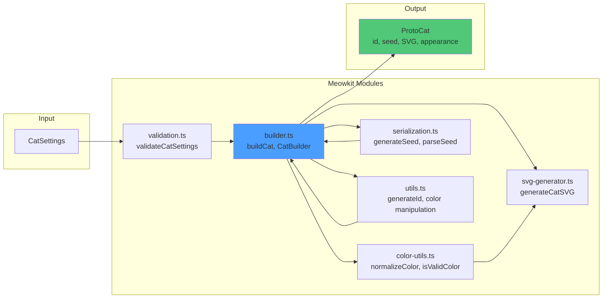
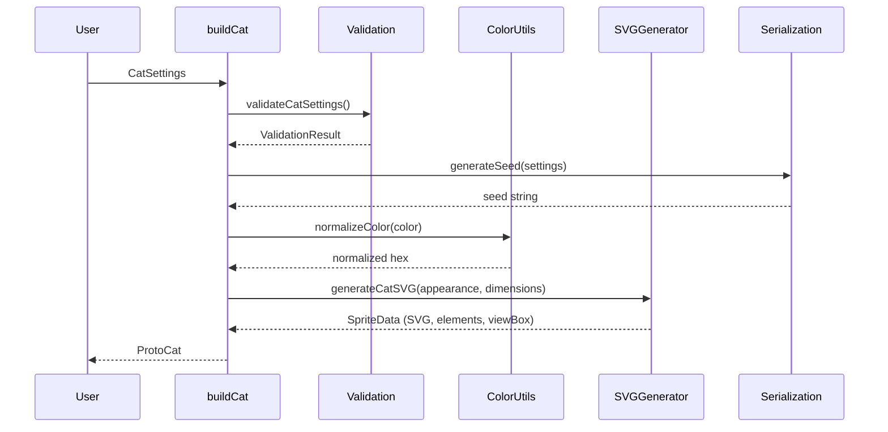

# Meowkit

Character creation library for building customizable cat sprites.

## Overview

Meowkit transforms user-defined settings into a structured `ProtoCat` object that contains all the data needed to render and animate a cat character. This library focuses purely on data transformation and validation - it does not handle rendering or animation.

## Module Architecture



## Data Transformation Flow



## Core Concepts

### CatSettings (Input)

User-facing configuration object created by frontend code:

```typescript
interface CatSettings {
  color: string; // Primary fur color (hex or named color)
  eyeColor: string; // Eye color (hex or named color)
  pattern: CatPattern; // Fur pattern type
  size: CatSize; // Overall size category
  furLength: FurLength; // Fur length style
}

type CatPattern = "solid" | "tabby" | "calico" | "tuxedo" | "spotted";
type CatSize = "small" | "medium" | "large";
type FurLength = "short" | "medium" | "long";
```

### ProtoCat (Output)

Complete data structure containing all information needed for rendering and animation:

```typescript
interface ProtoCat {
  id: string; // Unique identifier
  seed: string; // Compact seed for regeneration
  appearance: AppearanceData; // Visual properties
  dimensions: DimensionData; // Size and hitbox information
  spriteData: SpriteData; // Generated SVG data (not persisted)
  metadata: MetadataInfo; // Creation timestamp, version, etc.
}

interface AppearanceData {
  color: string;
  eyeColor: string;
  pattern: CatPattern;
  furLength: FurLength;
  // Derived colors for shading/highlights
  shadingColor: string;
  highlightColor: string;
}

interface DimensionData {
  size: CatSize;
  width: number; // Base width in viewBox units
  height: number; // Base height in viewBox units
  scale: number; // Display scale multiplier
  hitbox: {
    offsetX: number;
    offsetY: number;
    width: number;
    height: number;
  };
}

interface SpriteData {
  svg: string; // Complete SVG markup
  elements: SVGElements; // Named SVG elements for animation
  viewBox: ViewBox; // SVG coordinate system
}

interface SVGElements {
  body: string; // Body shape element ID
  head: string; // Head shape element ID
  ears: string[]; // Ear element IDs
  eyes: string[]; // Eye element IDs
  tail: string; // Tail element ID
  pattern?: string[]; // Pattern overlay element IDs (if applicable)
}

interface ViewBox {
  x: number;
  y: number;
  width: number;
  height: number;
}

interface MetadataInfo {
  createdAt: Date;
  version: string; // Meowkit version used to create
}
```

## Architecture

Meowkit is now organized into focused modules:

- **`builder.ts`** - Cat construction and builder pattern
- **`validation.ts`** - Settings validation
- **`serialization.ts`** - Seed generation, parsing, and JSON serialization
- **`svg-generator.ts`** - SVG sprite generation
- **`color-utils.ts`** - Color validation and normalization
- **`utils.ts`** - General utilities (ID generation, color manipulation)

All public functions are exported through `index.ts`.

## API Reference

### Building Cats

#### `buildCat(settings: CatSettings): ProtoCat`

Creates a complete ProtoCat from user settings. Validates settings and throws an error if invalid.

```typescript
import { buildCat } from "../meowkit/index.js";

const protoCat = buildCat({
  color: "#FF9500",
  eyeColor: "#00FF00",
  pattern: "tabby",
  size: "medium",
  furLength: "short",
});
```

#### `buildCatFromSeed(seed: string): ProtoCat`

Generates a ProtoCat from a seed string. This is the primary way to recreate cats from storage.

```typescript
import { buildCatFromSeed } from "../meowkit/index.js";

const protoCat = buildCatFromSeed("tabby-FF9500-00FF00-m-short-v1");
```

### Validation

#### `validateCatSettings(settings: CatSettings): ValidationResult`

Validates CatSettings before building. Also exported as `validateSettings` for backward compatibility.

```typescript
import { validateCatSettings } from "@meowzer/meowkit";

const result = validateCatSettings(settings);
if (!result.valid) {
  console.error(result.errors);
}

interface ValidationResult {
  valid: boolean;
  errors: string[];
}
```

### Seed System

#### `generateSeed(settings: CatSettings): string`

Generates a compact seed string from CatSettings.

**Format:** `pattern-color-eyeColor-size-furLength-v1`

**Example:** `"tabby-FF9500-00FF00-m-short-v1"`

```typescript
import { generateSeed } from "../meowkit/index.js";

const seed = generateSeed(settings);
// "tabby-FF9500-00FF00-m-short-v1"
```

#### `parseSeed(seed: string): CatSettings`

Parses a seed string back into CatSettings. Throws an error if seed is invalid or version unsupported.

```typescript
import { parseSeed } from "../meowkit/index.js";

const settings = parseSeed("tabby-FF9500-00FF00-m-short-v1");
```

### Serialization

#### `serializeCat(cat: ProtoCat): string`

Converts ProtoCat to minimal JSON for storage (seed + metadata only). SVG is regenerated on deserialization.

```typescript
import { serializeCat } from "../meowkit/index.js";

const json = serializeCat(protoCat);
// {"id":"cat-123","seed":"tabby-...","metadata":{...}}
```

#### `deserializeCat(json: string): ProtoCat`

Reconstructs ProtoCat from stored JSON by regenerating from seed.

```typescript
import { deserializeCat } from "../meowkit/index.js";

const protoCat = deserializeCat(json);
```

### Color Utilities

#### `isValidColor(color: string): boolean`

Checks if a color string is valid (hex format or named color).

```typescript
import { isValidColor } from "../meowkit/index.js";

isValidColor("#FF9500"); // true
isValidColor("orange"); // true
isValidColor("invalid"); // false
```

**Supported named colors:** black, white, red, green, blue, yellow, orange, purple, pink, brown, gray, grey, cyan, magenta, lime, navy

#### `normalizeColor(color: string): string`

Normalizes color to uppercase hex format without `#` prefix. Converts named colors to hex.

```typescript
import { normalizeColor } from "../meowkit/index.js";

normalizeColor("#ff9500"); // "FF9500"
normalizeColor("orange"); // "FFA500"
```

### General Utilities

#### `generateId(): string`

Generates a unique ID for cats.

```typescript
import { generateId } from "../meowkit/index.js";

const id = generateId(); // "cat-1234567890-abc123"
```

### SVG Generation

#### `generateCatSVG(appearance: AppearanceData, dimensions: DimensionData): SpriteData`

Generates complete SVG sprite data for a cat. Typically used internally by `buildCat`, but can be used directly for custom workflows.

```typescript
import { generateCatSVG } from "../meowkit/index.js";

const spriteData = generateCatSVG(appearance, dimensions);
// Returns: { svg: "...", elements: {...}, viewBox: {...} }
```

## Implementation Details

### SVG Generation

The library procedurally generates pixel-art style SVG sprites:

1. **Pixel-Art Style**: Uses blocky, rectangular geometry with `shape-rendering="crispEdges"`
2. **Side Profile**: Cat is shown in profile (side view) facing right
3. **Color Application**: Applies `fill` attributes based on appearance settings
4. **Pattern Overlays**: Adds pattern-specific elements (tabby stripes, calico patches, etc.)
5. **Shading**: Uses darker color variants (30% darker) for depth
6. **Element IDs**: Assigns unique IDs to each element for animation targeting

**Generated elements:**

- Body (main torso)
- Head (with snout)
- Ears (left and right)
- Eyes (left and right, with highlights)
- Tail (curved path)
- Legs (4 legs: back-left, back-right, front-left, front-right)
- Pattern overlays (when applicable)

### Size Variants

Size settings affect the display scale multiplier:

- **Small**: scale 0.65
- **Medium**: scale 1.0
- **Large**: scale 1.5

Base viewBox is consistent (`0 0 100 100`) with scaling applied via the `scale` property in `DimensionData`.

### Seed Format

Seeds use a **delimited format** for readability and URL-safety:

**Format (without hat):** `pattern-color-eyeColor-sizeChar-furLength-v1`

**Format (with hat):** `pattern-color-eyeColor-sizeChar-furLength-hatType-hatBase-hatAccent-v1`

**Size encoding:**

- `s` = small
- `m` = medium
- `l` = large

**Example (basic):** `"tabby-FF9500-00FF00-m-short-v1"`

**Example (with hat):** `"tabby-FF9500-00FF00-m-short-tophat-000000-FFFFFF-v1"`

**Properties:**

- **Deterministic**: Same settings always produce same seed
- **Compact**: Typically 30-40 characters (without hat) or 50-60 characters (with hat)
- **Versioned**: Includes `v1` marker for future compatibility
- **Readable**: Human-parseable for debugging and sharing

### Performance

- SVG regenerated from seed on demand (fast operation)
- No need to persist large SVG strings in storage
- Derived colors (shading, highlights) pre-computed during build
- Stateless, pure functions enable easy caching

### Dependencies

Zero external dependencies for sprite generation:

- Native JavaScript for color manipulation (bit shifting)
- Template literals for SVG markup generation
- Pure functions for data transformation
- Built-in validation with clear error messages

## Usage Examples

### Creating a New Cat

```typescript
import { buildCat } from "../meowkit/index.js";

const settings = {
  color: "#FF9500",
  eyeColor: "#00FF00",
  pattern: "tabby",
  size: "medium",
  furLength: "short",
};

const protoCat = buildCat(settings);

console.log(protoCat.seed);
// "tabby-FF9500-00FF00-m-short-v1"

console.log(protoCat.id);
// "cat-1730000000000-a3b4c5d"

// Use the SVG
document.body.innerHTML = protoCat.spriteData.svg;
```

### Recreating a Cat from Seed

```typescript
import { buildCatFromSeed } from "../meowkit/index.js";

// Retrieve stored seed (e.g., from database)
const seed = "tabby-FF9500-00FF00-m-short-v1";
const protoCat = buildCatFromSeed(seed);

// Same appearance, new ID
console.log(protoCat.appearance.color); // "#FF9500"
```

### Validating Settings

```typescript
import { validateCatSettings } from "../meowkit/index.js";

const settings = {
  color: "invalid-color",
  eyeColor: "#00FF00",
  pattern: "tabby",
  size: "medium",
  furLength: "short",
};

const result = validateCatSettings(settings);
if (!result.valid) {
  console.error("Validation errors:", result.errors);
  // ["Invalid color format. Use hex (e.g., #FF9500) or named colors."]
}
```

### Sharing Cats

```typescript
import { buildCat, buildCatFromSeed } from "../meowkit/index.js";

// User creates a cat
const myCat = buildCat({
  color: "#FF9500",
  eyeColor: "#00FF00",
  pattern: "calico",
  size: "medium",
  furLength: "long",
});

// Share the seed (only ~35 characters!)
const shareableCode = myCat.seed;
console.log(`My cat: ${shareableCode}`);

// Friend recreates the exact same cat appearance
const friendsCat = buildCatFromSeed(shareableCode);
```

### Full Serialization (with Metadata)

```typescript
import { serializeCat, deserializeCat } from "../meowkit/index.js";

// Serialize for storage (includes ID and creation date)
const json = serializeCat(protoCat);

// Later: Deserialize
const restoredCat = deserializeCat(json);

console.log(restoredCat.id); // Original ID preserved
console.log(restoredCat.metadata.createdAt); // Original creation date
```

### Working with Colors

```typescript
import { isValidColor, normalizeColor } from "../meowkit/index.js";

// Validation
isValidColor("#FF9500"); // true
isValidColor("orange"); // true
isValidColor("nope"); // false

// Normalization
normalizeColor("#ff9500"); // "FF9500"
normalizeColor("orange"); // "FFA500"
```

## Future Enhancements

- Additional patterns (bicolor, tortoiseshell, etc.)
- More accessory types (collars, bows, glasses, etc.)
- Breed-specific variations (ear shapes, tail lengths)
- Animation hint data (personality traits affecting movement)
- Export to various formats (standalone SVG file, data URL, etc.)
- Optional pixelated aesthetic mode using geometric shapes only
