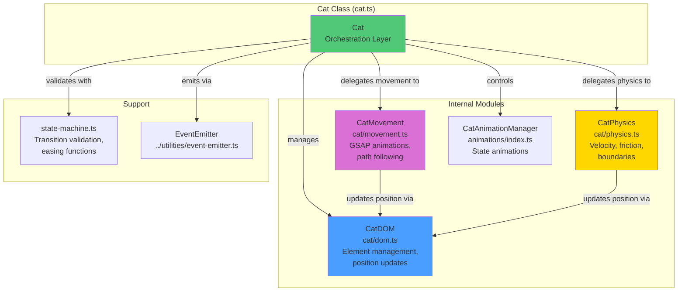
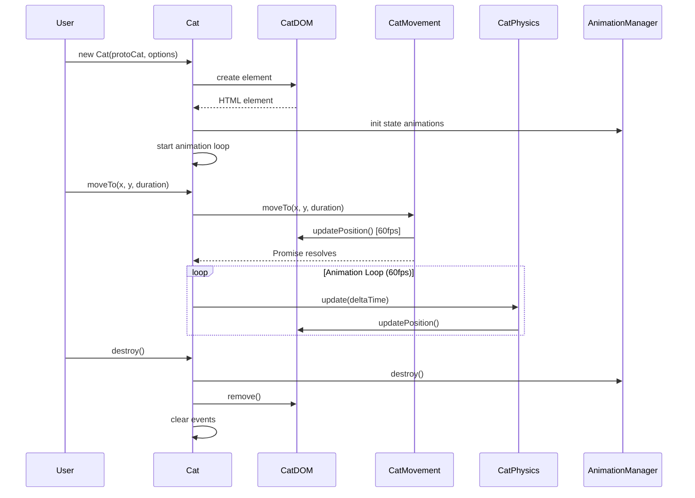

# Meowtion

Animation library for bringing cat sprites to life with movement and physics.

## Overview

Meowtion takes a `ProtoCat` object (from Meowkit) and creates an animated `Cat` instance that can move around a web page. This library handles rendering, animation states, and physics primitives. It provides low-level animation controls that are meant to be controlled by Meowbrain (the AI library) rather than directly by users.

## Module Architecture



## Cat Instance Lifecycle



## Core Concepts

### Cat Class

The primary object created by Meowtion - a fully animated cat instance:

```typescript
class Cat {
  readonly id: string;
  readonly element: HTMLElement;
  readonly protoCat: ProtoCat;

  // Getters
  get state(): CatState;
  get position(): Position;
  get velocity(): Velocity;
  get boundaries(): Boundaries;
  get isActive(): boolean;

  // State management
  setState(newState: CatStateType): void;

  // Movement methods
  moveTo(x: number, y: number, duration?: number): Promise<void>;
  moveAlongPath(
    points: Position[],
    duration?: number,
    options?: PathOptions
  ): Promise<void>;
  setPosition(x: number, y: number): void;
  setVelocity(vx: number, vy: number): void;
  stop(): void;

  // Lifecycle
  pause(): void;
  resume(): void;
  reinitializeAnimations(): void;
  destroy(): void;

  // Events
  on(event: CatEvent, handler: EventHandler): void;
  off(event: CatEvent, handler: EventHandler): void;
}
```

### Type Definitions

```typescript
interface Position {
  x: number; // X coordinate (pixels)
  y: number; // Y coordinate (pixels)
}

interface Velocity {
  x: number; // X velocity (pixels/second)
  y: number; // Y velocity (pixels/second)
}

type CatStateType =
  | "idle"
  | "walking"
  | "running"
  | "sitting"
  | "sleeping"
  | "playing";

interface CatState {
  type: CatStateType;
  startTime: number; // When this state began (timestamp)
  loop: boolean; // Whether animation loops
}

interface PathOptions {
  ease?: string; // GSAP easing (default: "power1.inOut")
  loop?: boolean; // Loop the path (default: false)
}

type CatEvent =
  | "stateChange" // Emitted when state changes
  | "moveStart" // Emitted when movement begins
  | "moveEnd" // Emitted when movement completes
  | "boundaryHit"; // Emitted when hitting boundaries

type EventHandler = (data?: any) => void;

interface Boundaries {
  minX?: number;
  maxX?: number;
  minY?: number;
  maxY?: number;
}

interface PhysicsOptions {
  gravity?: boolean; // Apply gravity effect (default: false)
  friction?: number; // Movement friction 0-1 (default: 0.1)
  maxSpeed?: number; // Maximum velocity pixels/second (default: 300)
}
```

## API Reference

### Creating Animated Cats

#### `animateCat(protoCat: ProtoCat, options?: AnimationOptions): Cat`

Creates an animated Cat instance from a ProtoCat.

```typescript
import { animateCat } from "../meowtion/index.js";

const cat = animateCat(protoCat, {
  container: document.getElementById("playground"),
  initialPosition: { x: 100, y: 100 },
  initialState: "idle",
  physics: {
    gravity: false,
    friction: 0.1,
    maxSpeed: 300,
  },
  boundaries: {
    minX: 0,
    maxX: 800,
    minY: 0,
    maxY: 600,
  },
});
```

**Options:**

```typescript
interface AnimationOptions {
  container?: HTMLElement; // Where to append (default: document.body)
  initialPosition?: Position; // Starting position (default: {x: 0, y: 0})
  initialState?: CatStateType; // Starting state (default: 'idle')
  physics?: PhysicsOptions; // Physics configuration
  boundaries?: Boundaries; // Movement constraints
}
```

### Cat Class Methods

#### State Management

**`setState(newState: CatStateType): void`**

Changes the cat's animation state. Validates transitions using state machine.

```typescript
cat.setState("walking"); // Valid from idle
cat.setState("sleeping"); // Invalid from walking - logs warning
```

#### Movement

**`moveTo(x: number, y: number, duration?: number): Promise<void>`**

Smoothly moves cat to target position with animation.

```typescript
await cat.moveTo(400, 200, 2000); // Move to (400, 200) over 2 seconds
console.log("Movement complete!");
```

**`moveAlongPath(points: Position[], duration?: number, options?: PathOptions): Promise<void>`**

Moves cat along a curved path through multiple points.

```typescript
await cat.moveAlongPath(
  [
    { x: 100, y: 100 },
    { x: 200, y: 150 },
    { x: 300, y: 100 },
  ],
  3000,
  { ease: "power2.inOut" }
);
```

**`setPosition(x: number, y: number): void`**

Immediately sets position without animation. Clamps to boundaries.

```typescript
cat.setPosition(200, 150);
```

**`setVelocity(vx: number, vy: number): void`**

Sets velocity for physics-based movement.

```typescript
cat.setVelocity(100, 0); // Move right at 100 px/s
```

**`stop(): void`**

Stops all movement and returns to idle state if currently walking/running.

```typescript
cat.stop();
```

#### Lifecycle

**`pause(): void`**

Pauses all animations and movement.

```typescript
cat.pause();
```

**`resume(): void`**

Resumes paused animations and movement.

```typescript
cat.resume();
```

**`reinitializeAnimations(): void`**

Reinitializes the animation system after the cat's SVG has been replaced.

**⚠️ Important:** This method must be called whenever the cat's SVG element is replaced in the DOM (e.g., when restoring appearance from storage, changing accessories, or any operation that regenerates the SVG). GSAP animations hold references to specific DOM elements, so when the SVG is replaced, those references become stale and animations will stop working.

```typescript
// After replacing the SVG (e.g., loading from storage)
cat.setAppearance(savedAppearance);
cat.reinitializeAnimations(); // Required!
```

**`destroy(): void`**

Destroys the cat instance and removes from DOM. Cleans up all resources.

```typescript
cat.destroy();
```

#### Events

**`on(event: CatEvent, handler: EventHandler): void`**

Registers an event listener.

```typescript
cat.on("stateChange", ({ oldState, newState }) => {
  console.log(`State: ${oldState} → ${newState}`);
});

cat.on("moveEnd", () => {
  console.log("Movement finished");
});

cat.on("boundaryHit", ({ direction }) => {
  console.log(`Hit ${direction} boundary`);
});
```

**`off(event: CatEvent, handler: EventHandler): void`**

Removes an event listener.

```typescript
const handler = () => console.log("Moved");
cat.on("moveEnd", handler);
cat.off("moveEnd", handler);
```

### Other Exports

#### `injectBaseStyles(): void`

Injects required CSS animations into the document. Called automatically by Cat constructor.

#### `CatAnimationManager`

Internal class managing GSAP animations. Typically not used directly.

## Animation System

### State Machine

Cats use a state machine to manage animation transitions. Not all transitions are allowed:

**Valid State Transitions:**

- `idle` → `walking`, `running`, `sitting`, `playing`, `sleeping`
- `walking` → `idle`, `running`, `sitting`
- `running` → `idle`, `walking`
- `sitting` → `idle`, `sleeping`
- `sleeping` → `idle`, `sitting`
- `playing` → `idle`, `walking`
- Any state → `idle` (always allowed)

**Transition Durations:**

The state machine defines transition times for smooth state changes:

- `idle` ↔ `walking`: 300ms
- `walking` ↔ `running`: 200ms
- `running` → `idle`: 400ms
- `idle` ↔ `sitting`: 500ms
- `sitting` ↔ `sleeping`: 1000-2000ms
- `idle` ↔ `playing`: 300ms

**Easing Functions:**

Available in `state-machine.ts`:

- `easeInOutCubic(t)` - Smooth acceleration/deceleration
- `easeOutQuad(t)` - Decelerating to zero
- `easeOutElastic(t)` - Bouncy effect

### GSAP Animations

Meowtion uses GSAP for state-based animations:

- **Idle**: Gentle breathing, occasional tail sway, rare blinks
- **Walking**: Leg movement, moderate tail sway, slight body bounce
- **Running**: Fast leg movement, tail horizontal, pronounced bounce
- **Sitting**: Slow breathing, gentle tail movement
- **Sleeping**: Very slow breathing, minimal movement
- **Playing**: Energetic movements, rapid tail swaying

Animations are managed by `CatAnimationManager` and applied to specific SVG elements using IDs from the ProtoCat's `spriteData.elements`.

## Movement System

### Movement Architecture

Meowtion separates movement into two systems:

1. **Animated Movement** (`cat/movement.ts`): GSAP-based tweened movement for `moveTo()` and `moveAlongPath()`
2. **Physics Movement** (`cat/physics.ts`): Velocity-based movement with friction, gravity, and boundaries

### Movement Methods

**`moveTo(x, y, duration)`**

- Uses GSAP for smooth interpolation
- Automatically sets state to "walking" or "running" based on distance
- Returns Promise that resolves when movement completes
- Can be cancelled with `stop()`
- Respects boundaries (clamps to edges)

**`moveAlongPath(points, duration, options)`**

- Creates curved path through multiple points
- Uses Bezier curves for natural movement
- Configurable easing (default: "power1.inOut")
- Optional looping
- Automatically faces direction of movement

**`setVelocity(vx, vy)`**

- Sets physics-based velocity
- Physics system updates position each frame
- Applies friction over time
- Clamped to `maxSpeed` setting
- Used for continuous movement (e.g., wandering)

### Boundary Behavior

When a cat hits a boundary:

1. Position is clamped to boundary edge
2. Velocity is set to zero
3. `boundaryHit` event is emitted with `{ direction: "left" | "right" | "top" | "bottom" }`
4. Movement tween is cancelled (for `moveTo`)
5. Cat can decide new behavior (typically via Meowbrain)

## Implementation Details

### DOM Structure

Each cat creates this DOM structure:

```html
<div
  class="meowtion-cat"
  data-cat-id="cat-1234567890-abc123"
  data-state="idle"
  style="position: absolute; left: 100px; top: 100px; transform: scaleX(1);"
>
  <svg
    viewBox="0 0 100 100"
    width="100"
    height="100"
    shape-rendering="crispEdges"
  >
    <!-- SVG content from ProtoCat -->
  </svg>
</div>
```

The container element is managed by `CatDOM` class which handles:

- Position updates via CSS transforms
- State attribute updates
- Facing direction (scaleX for flipping)
- Paused state
- Removal from DOM

### Modular Components

**`CatDOM`** (`cat/dom.ts`)

- Creates and manages the DOM element
- Updates position, state, and direction
- Handles element removal

**`CatMovement`** (`cat/movement.ts`)

- GSAP-based movement animations
- Path following with Bezier curves
- Automatic direction facing
- Movement cancellation

**`CatPhysics`** (`cat/physics.ts`)

- Velocity-based movement
- Friction and gravity simulation
- Boundary collision detection
- Speed clamping

**`CatAnimationManager`** (`animations/index.ts`)

- State-based GSAP animations
- Manages timelines for each state
- Animates specific SVG elements (tail, legs, body, etc.)

### SVG Replacement and Animation Reinitialization

**Critical consideration:** When a cat's SVG element is replaced in the DOM, GSAP animations break because they hold references to the old, detached SVG elements.

**When SVG replacement happens:**

- Loading cat from storage with saved appearance
- Changing accessories (hats, collars, etc.)
- Any operation that calls `setAppearance()` or regenerates the SVG

**The solution:** Call `cat.reinitializeAnimations()` immediately after any SVG replacement. This method:

1. Kills all existing GSAP animations
2. Re-caches references to the new SVG elements (legs, tail, body, etc.)
3. Recreates the animation pool with the new element references
4. Restarts animations for the current state

```typescript
// Example: Loading from storage
const cat = await storage.loadCat(catId);
// Storage manager automatically calls reinitializeAnimations()
// if appearance data is restored

// Example: Manual SVG replacement
cat.setAppearance(newAppearance);
cat.reinitializeAnimations(); // Required!
```

### Performance Optimization

- Uses CSS `transform` and `opacity` for GPU acceleration
- Animation loop runs at 60 FPS using `requestAnimationFrame`
- Paused cats skip frame updates
- GSAP handles animation optimization internally
- Physics calculations only run when velocity is non-zero
- Event emitter uses WeakMap for efficient cleanup

### Dependencies

Meowtion has **one external dependency**:

- **GSAP** (GreenSock Animation Platform) - For professional-grade animations

GSAP provides:

- Smooth tweening and easing
- Timeline management
- Path morphing and following
- Performance-optimized animations
- Pause/resume capabilities

## Usage Examples

### Basic Setup

```typescript
import { buildCatFromSeed } from "../meowkit/index.js";
import { animateCat } from "../meowtion/index.js";

const protoCat = buildCatFromSeed("tabby-FF9500-00FF00-m-short-v1");
const cat = animateCat(protoCat, {
  container: document.getElementById("playground"),
  initialPosition: { x: 100, y: 100 },
  initialState: "idle",
  boundaries: {
    minX: 0,
    maxX: window.innerWidth,
    minY: 0,
    maxY: window.innerHeight,
  },
});
```

### Movement Examples

```typescript
// Simple movement
await cat.moveTo(400, 200, 2000); // Move over 2 seconds
cat.setState("sitting");

// Path following
await cat.moveAlongPath(
  [
    { x: 100, y: 100 },
    { x: 300, y: 200 },
    { x: 500, y: 100 },
  ],
  3000,
  { ease: "power2.inOut" }
);

// Physics-based movement
cat.setVelocity(150, 0); // Move right continuously
setTimeout(() => cat.stop(), 2000); // Stop after 2s

// Immediate position change
cat.setPosition(200, 150); // No animation
```

### Event Handling

```typescript
// Listen for state changes
cat.on("stateChange", ({ oldState, newState }) => {
  console.log(`Cat changed from ${oldState} to ${newState}`);
});

// Detect when movement finishes
cat.on("moveEnd", () => {
  console.log("Cat arrived at destination");
  cat.setState("sitting");
});

// Handle boundary collisions
cat.on("boundaryHit", ({ direction }) => {
  console.log(`Cat hit the ${direction} boundary`);
  // Meowbrain would decide what to do here
});
```

### Multiple Cats

```typescript
import { buildCatFromSeed } from "../meowkit/index.js";
import { animateCat } from "../meowtion/index.js";

const seeds = [
  "tabby-FF9500-00FF00-m-short-v1",
  "calico-FFFFFF-0000FF-s-long-v1",
  "tuxedo-000000-FFFF00-l-short-v1",
];

const cats = seeds.map((seed, index) => {
  const protoCat = buildCatFromSeed(seed);
  return animateCat(protoCat, {
    initialPosition: { x: 100 + index * 150, y: 100 },
    boundaries: {
      minX: 0,
      maxX: window.innerWidth,
      minY: 0,
      maxY: window.innerHeight,
    },
  });
});

// Control each cat independently
cats[0].moveTo(300, 200);
cats[1].setState("playing");
cats[2].setVelocity(100, 50);
```

### Lifecycle Management

```typescript
// Pause animations (useful when tab is inactive)
document.addEventListener("visibilitychange", () => {
  if (document.hidden) {
    cat.pause();
  } else {
    cat.resume();
  }
});

// Cleanup when done
function cleanup() {
  cat.destroy(); // Removes from DOM and clears event listeners
}
```

## Integration with Meowbrain

Meowtion is designed to be controlled by Meowbrain, the AI library. While you can use Meowtion directly for scripted animations, the recommended approach is:

```typescript
import { buildCatFromSeed } from "../meowkit/index.js";
import { animateCat } from "../meowtion/index.js";
import { createBrain } from "../meowbrain/index.js";

const protoCat = buildCatFromSeed("tabby-FF9500-00FF00-m-short-v1");
const cat = animateCat(protoCat);
const brain = createBrain(cat, { personality: "playful" });

brain.start(); // Cat now acts autonomously
```

## Future Enhancements

- **Sound effects**: Purring, meowing (optional audio)
- **Collision detection**: Emit events when cats collide with each other
- **Particle effects**: Hearts, Z's, etc. (visual feedback)
- **Sprite swapping**: Different poses for each state
- **Path constraints**: Follow predefined paths or rails
- **React/Vue/Svelte wrappers**: Framework-specific components
