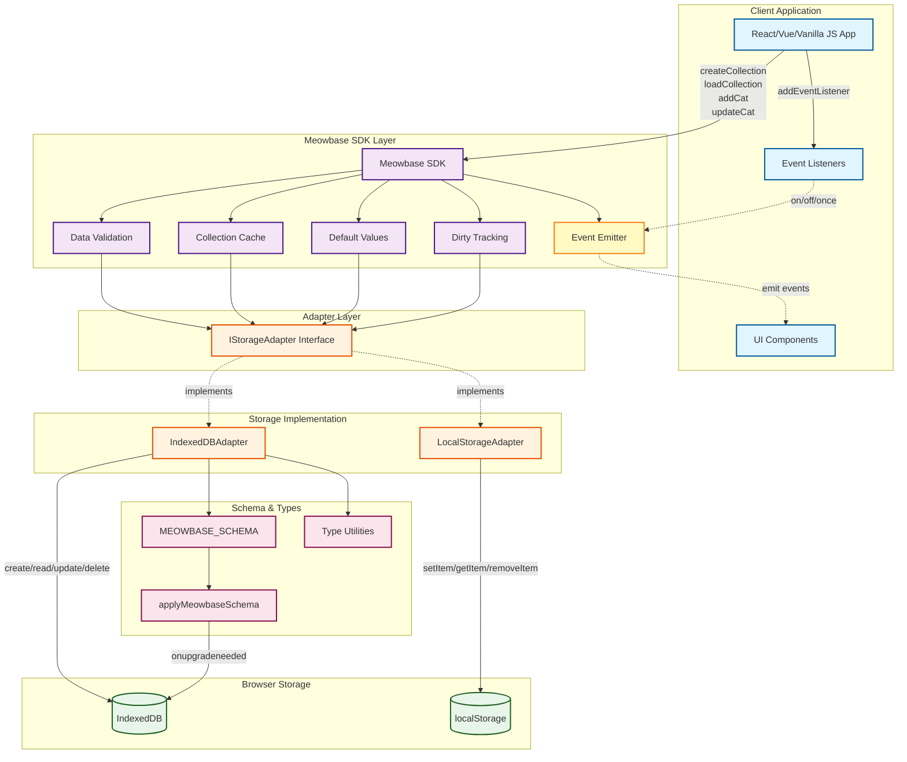
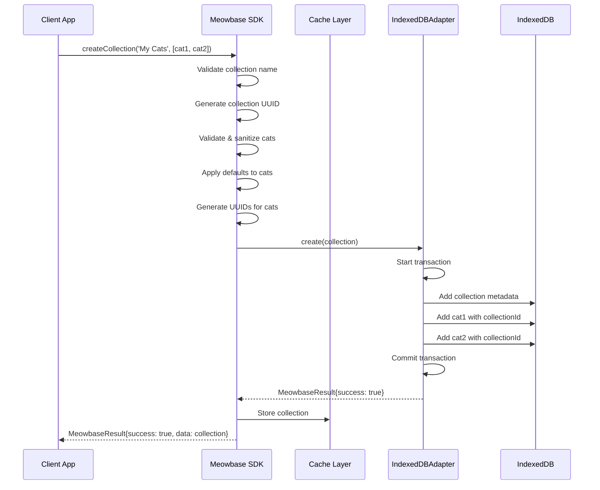
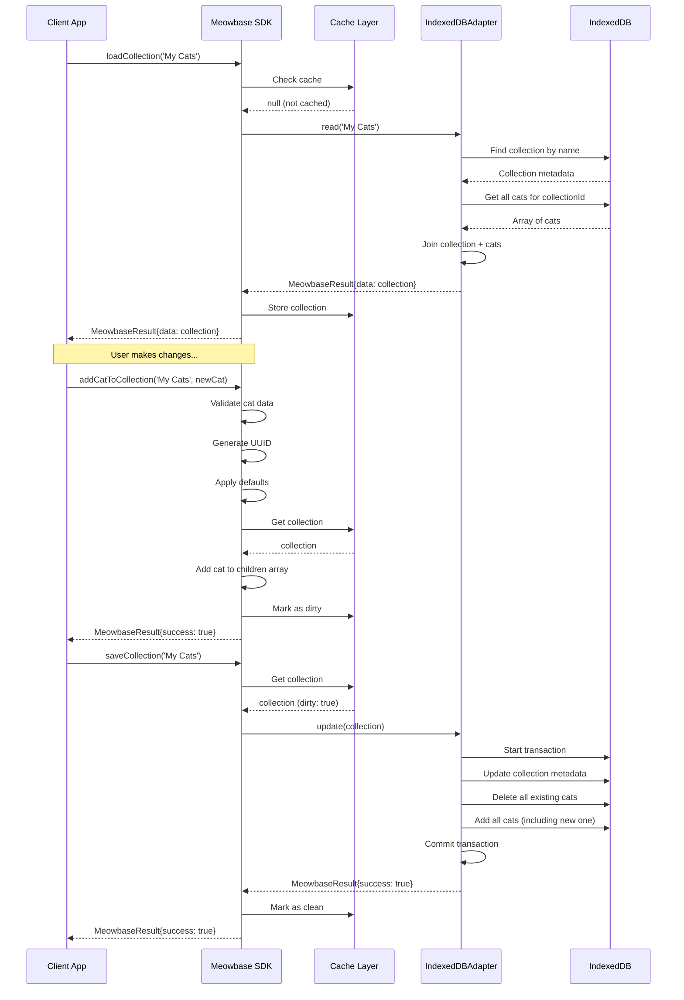
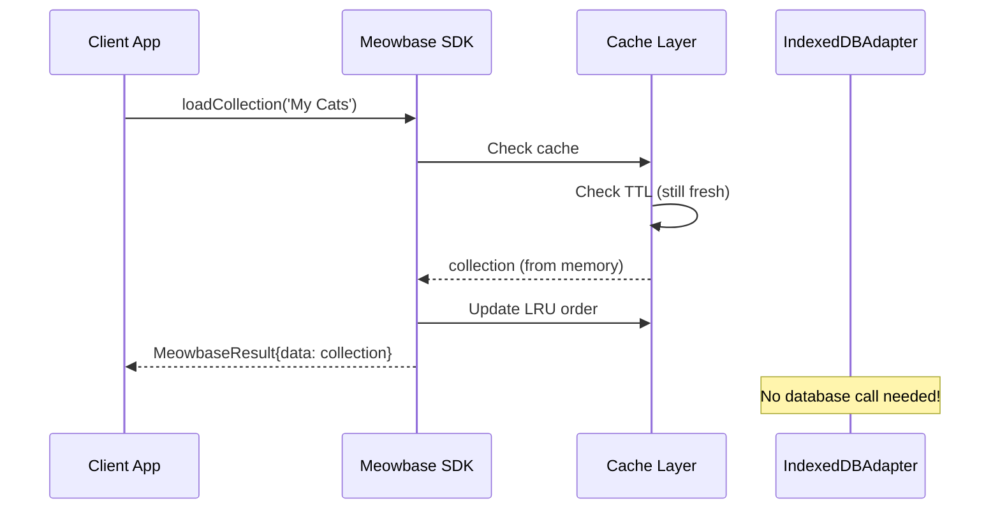

# IndexedDB Adapter Interface

## Overview

This document defines the contract between Meowbase's high-level API and the IndexedDB storage layer. The adapter provides a clean abstraction that allows Meowbase to work with IndexedDB while maintaining the same public API as the localStorage implementation.

## Design Principles

1. **Promise-based**: All methods return Promises (IndexedDB is async)
2. **Type-safe**: Full TypeScript type coverage using schema-derived types
3. **ACID-compliant**: Operations use IndexedDB transactions
4. **Backwards-compatible API**: Maintains same method signatures as localStorage adapter
5. **Result pattern**: Uses `MeowbaseResult<T>` for consistent error handling

## Core Interface

```typescript
interface IStorageAdapter {
  // Lifecycle
  initialize(): Promise<void>;
  close(): Promise<void>;

  // Collection Operations
  create(collection: Collection): Promise<MeowbaseResult<Collection>>;
  read(identifier: string): Promise<MeowbaseResult<Collection>>;
  update(collection: Collection): Promise<MeowbaseResult>;
  delete(identifier: string): Promise<MeowbaseResult>;
  list(): Promise<MeowbaseResult<CollectionInfo[]>>;
  findKey(identifier: string): Promise<string | null>;
}
```

## Endpoint Specifications

### Lifecycle Management

#### `initialize(): Promise<void>`

**Purpose**: Open IndexedDB connection and apply schema migrations

**Implementation**:

- Opens database connection using `MEOWBASE_SCHEMA.name` and `MEOWBASE_SCHEMA.version`
- Triggers `onupgradeneeded` event for schema migrations
- Calls `applyMeowbaseSchema()` to create/update object stores
- Stores database connection for subsequent operations

**Success**: Resolves when database is ready
**Failure**: Rejects with error (blocked, version conflict, quota exceeded)

**Example**:

```typescript
const adapter = new IndexedDBAdapter();
await adapter.initialize();
// Database ready for operations
```

---

#### `close(): Promise<void>`

**Purpose**: Close IndexedDB connection gracefully

**Implementation**:

- Closes active database connection
- Clears internal reference
- Prevents further operations until `initialize()` is called again

**Success**: Resolves when connection is closed
**Failure**: Resolves even if already closed

**Example**:

```typescript
await adapter.close();
// Connection closed, no more operations allowed
```

---

### Collection Operations

#### `create(collection: Collection): Promise<MeowbaseResult<Collection>>`

**Purpose**: Create a new collection with all its cats

**Parameters**:

- `collection`: Full `Collection` object with `id`, `name`, and `children` array

**Implementation**:

1. Start readwrite transaction on `['collections', 'cats']`
2. Add collection metadata to `collections` store (id, name only)
3. Iterate through `collection.children` and add each cat to `cats` store with `collectionId` foreign key
4. Commit transaction

**Success**: Returns collection with success message
**Failure**: Returns error if:

- Collection name already exists (unique constraint)
- Invalid data
- Transaction fails

**Example**:

```typescript
const collection: Collection = {
  id: crypto.randomUUID(),
  name: "My Cats",
  children: [cat1, cat2, cat3],
};

const result = await adapter.create(collection);
if (result.success) {
  console.log(`Created: ${result.data.name}`);
}
```

---

#### `read(identifier: string): Promise<MeowbaseResult<Collection>>`

**Purpose**: Retrieve a collection by ID or name, with all cats populated

**Parameters**:

- `identifier`: Collection ID (UUID) or collection name (string)

**Implementation**:

1. Start readonly transaction on `['collections', 'cats']`
2. Try to find collection by ID using `collections.get(identifier)`
3. If not found, try to find by name using `collections.index('name').get(identifier)`
4. If collection found, query `cats.index('collectionId').getAll(collection.id)`
5. Reconstruct full `Collection` object with `children` array populated

**Success**: Returns full collection with all cats
**Failure**: Returns error if collection not found

**Example**:

```typescript
// By ID
const result = await adapter.read(
  "550e8400-e29b-41d4-a716-446655440000"
);

// By name
const result = await adapter.read("My Cats");

if (result.success) {
  console.log(`Found ${result.data.children.length} cats`);
}
```

---

#### `update(collection: Collection): Promise<MeowbaseResult>`

**Purpose**: Update collection metadata and replace all cats

**Parameters**:

- `collection`: Full `Collection` object with updated data

**Implementation**:

1. Start readwrite transaction on `['collections', 'cats']`
2. Update collection metadata using `collections.put({ id, name })`
3. Delete all existing cats: query `cats.index('collectionId').getAll(collection.id)` then delete each
4. Add all cats from updated collection with `collectionId` foreign key
5. Commit transaction

**Success**: Returns success message
**Failure**: Returns error if:

- Collection doesn't exist
- Name conflict (if name changed to existing name)
- Transaction fails

**Example**:

```typescript
collection.name = "Updated Name";
collection.children.push(newCat);

const result = await adapter.update(collection);
if (result.success) {
  console.log("Collection updated");
}
```

**Note**: This is a full replacement strategy. All cats are deleted and re-added. For granular cat updates, use cat-specific operations (see Extended Interface below).

---

#### `delete(identifier: string): Promise<MeowbaseResult>`

**Purpose**: Delete a collection and all its cats (cascade delete)

**Parameters**:

- `identifier`: Collection ID or name

**Implementation**:

1. Call `read(identifier)` to get collection ID
2. Start readwrite transaction on `['collections', 'cats']`
3. Delete all cats: query `cats.index('collectionId').getAll(collectionId)` then delete each
4. Delete collection: `collections.delete(collectionId)`
5. Commit transaction

**Success**: Returns success message with count of deleted cats
**Failure**: Returns error if collection not found

**Example**:

```typescript
const result = await adapter.delete("My Cats");
if (result.success) {
  console.log("Collection and all cats deleted");
}
```

---

#### `list(): Promise<MeowbaseResult<CollectionInfo[]>>`

**Purpose**: Get metadata for all collections with cat counts

**Returns**: Array of `CollectionInfo` objects

**Type Definition**:

```typescript
interface CollectionInfo {
  id: string;
  name: string;
  catCount: number;
}
```

**Implementation**:

1. Start readonly transaction on `['collections', 'cats']`
2. Get all collections using `collections.getAll()`
3. For each collection, count cats using `cats.index('collectionId').count(collection.id)`
4. Build `CollectionInfo` array

**Success**: Returns array of collection metadata
**Failure**: Returns error if database operation fails

**Example**:

```typescript
const result = await adapter.list();
if (result.success) {
  result.data.forEach((info) => {
    console.log(`${info.name}: ${info.catCount} cats`);
  });
}
```

**Performance Note**: This method is optimized for metadata only. It does NOT load cat data, making it fast for listing/navigation UIs.

---

#### `findKey(identifier: string): Promise<string | null>`

**Purpose**: Get the storage key for a collection (compatibility with localStorage pattern)

**Parameters**:

- `identifier`: Collection ID or name

**Implementation**:

1. Try to find collection by ID
2. If not found, try by name using index
3. Return formatted key: `meowbase-{id}` or `null`

**Returns**: Storage key string or null if not found

**Example**:

```typescript
const key = await adapter.findKey("My Cats");
// Returns: 'meowbase-550e8400-e29b-41d4-a716-446655440000'
```

**Note**: This maintains compatibility with localStorage adapter's key format. May be deprecated in future versions.

---

## Extended Interface (Optional)

These operations provide more granular control over cats without loading entire collections. They're optional extensions beyond the minimal `IStorageAdapter` interface.

```typescript
interface IExtendedStorageAdapter extends IStorageAdapter {
  // Individual Cat Operations
  addCat(
    collectionId: string,
    cat: Cat
  ): Promise<MeowbaseResult<Cat>>;
  readCat(
    collectionId: string,
    catId: string
  ): Promise<MeowbaseResult<Cat>>;
  updateCat(cat: Cat, collectionId: string): Promise<MeowbaseResult>;
  deleteCat(
    collectionId: string,
    catId: string
  ): Promise<MeowbaseResult>;

  // Query Operations
  getCatsByCollection(
    collectionId: string
  ): Promise<MeowbaseResult<Cat[]>>;
  findCatByName(
    collectionId: string,
    name: string
  ): Promise<MeowbaseResult<Cat>>;
  getCatsByBirthdayRange(
    start: Date,
    end: Date
  ): Promise<MeowbaseResult<Cat[]>>;

  // Transaction Support
  beginTransaction(
    stores: StoreNames[],
    mode: "readonly" | "readwrite"
  ): Promise<IDBTransaction>;
}
```

### Individual Cat Operations

#### `addCat(collectionId: string, cat: Cat): Promise<MeowbaseResult<Cat>>`

**Purpose**: Add a single cat to a collection

**Implementation**:

1. Verify collection exists
2. Add cat with `collectionId` foreign key
3. Return created cat

---

#### `readCat(collectionId: string, catId: string): Promise<MeowbaseResult<Cat>>`

**Purpose**: Retrieve a single cat

**Implementation**:

1. Query `cats.get(catId)`
2. Verify `cat.collectionId` matches parameter
3. Return cat

---

#### `updateCat(cat: Cat, collectionId: string): Promise<MeowbaseResult>`

**Purpose**: Update a single cat's data

**Implementation**:

1. Update cat using `cats.put({ ...cat, collectionId })`
2. Return success/failure

---

#### `deleteCat(collectionId: string, catId: string): Promise<MeowbaseResult>`

**Purpose**: Remove a single cat from a collection

**Implementation**:

1. Verify cat belongs to collection
2. Delete using `cats.delete(catId)`
3. Return success/failure

---

### Query Operations

#### `getCatsByCollection(collectionId: string): Promise<MeowbaseResult<Cat[]>>`

**Purpose**: Get all cats in a collection (without collection metadata)

**Implementation**:

1. Query `cats.index('collectionId').getAll(collectionId)`
2. Return array of cats

**Use Case**: Loading cats on-demand after loading collection metadata

---

#### `findCatByName(collectionId: string, name: string): Promise<MeowbaseResult<Cat>>`

**Purpose**: Find a cat by name within a specific collection

**Implementation**:

1. Use compound index: `cats.index('by_collection_and_name').get([collectionId, name])`
2. Return matching cat or not found error

**Performance**: O(log n) using compound index

---

#### `getCatsByBirthdayRange(start: Date, end: Date): Promise<MeowbaseResult<Cat[]>>`

**Purpose**: Query cats born within a date range (across all collections)

**Implementation**:

1. Use `cats.index('birthday').getAll(IDBKeyRange.bound(start, end))`
2. Return matching cats

**Use Case**: Analytics, reporting, birthday reminders

---

### Transaction Support

#### `beginTransaction(stores: StoreNames[], mode): Promise<IDBTransaction>`

**Purpose**: Start a custom transaction for complex operations

**Parameters**:

- `stores`: Array of store names (type-safe with `StoreNames`)
- `mode`: `'readonly'` or `'readwrite'`

**Returns**: IndexedDB transaction object

**Use Case**: Atomic multi-operation updates

**Example**:

```typescript
const tx = await adapter.beginTransaction(
  ["collections", "cats"],
  "readwrite"
);
try {
  const store = tx.objectStore("cats");
  await store.add(cat1);
  await store.add(cat2);
  await tx.complete;
} catch (error) {
  tx.abort();
}
```

---

## Type Safety

All endpoints use schema-derived types for compile-time safety:

```typescript
// Type-safe store names
type StoreNames = 'collections' | 'cats' | 'metadata';

// Type-safe store records
type StoreRecord<'collections'> = CollectionMetadata;
type StoreRecord<'cats'> = CatStorageRecord;
type StoreRecord<'metadata'> = { key: string; value: unknown };

// Usage
const store = this.getStore('collections', 'readwrite');
await store.add({
  id: '...',
  name: '...'
} satisfies StoreRecord<'collections'>);
```

## Error Handling

All endpoints return `MeowbaseResult<T>` for consistent error handling:

```typescript
type MeowbaseResult<T = void> =
  | { success: true; data?: T; message?: string }
  | { success: false; message: string };
```

### Common Error Scenarios

| Error                | Endpoint             | Message                                                   |
| -------------------- | -------------------- | --------------------------------------------------------- |
| `ConstraintError`    | `create()`           | "Collection with name '{name}' already exists"            |
| `NotFoundError`      | `read()`, `delete()` | "Collection '{identifier}' not found"                     |
| `QuotaExceededError` | Any write            | "Storage quota exceeded. Please delete some collections." |
| `VersionError`       | `initialize()`       | "Please close other tabs with Meowbase open to upgrade."  |
| `AbortError`         | Any                  | "Transaction failed: {reason}"                            |

## Performance Considerations

### Indexes Used

- **collections.name**: Fast lookup by collection name (unique)
- **cats.collectionId**: Fast join for collection → cats
- **cats.name**: Fast search by cat name (within or across collections)
- **cats.birthday**: Range queries for date-based filtering
- **cats.by_collecti43on_and_name**: Compound index for fast name lookup within collection

### Optimization Strategies

1. **Lazy Loading**: `list()` only loads metadata, not full cat data
2. **Batch Operations**: Use transactions to group multiple operations
3. **Read Transactions**: Multiple concurrent reads don't block each other
4. **Index Selection**: Query optimizer automatically selects best index

### Performance Targets

- `read()`: < 10ms for collections with < 100 cats
- `list()`: < 50ms for < 100 collections
- `create()`: < 20ms for collection with < 50 cats
- `update()`: < 30ms for collection with < 50 cats
- `delete()`: < 25ms for collection with < 100 cats

## Migration from localStorage

The interface maintains backwards compatibility with the localStorage adapter:

| Operation     | localStorage     | IndexedDB                             |
| ------------- | ---------------- | ------------------------------------- |
| **API**       | Synchronous      | Async (Promises)                      |
| **create()**  | Stores full JSON | Stores normalized (collection + cats) |
| **read()**    | Parses JSON      | Joins collection + cats               |
| **update()**  | Overwrites JSON  | Updates collection + replaces cats    |
| **delete()**  | Removes key      | Cascade deletes collection + cats     |
| **list()**    | Scans all keys   | Queries collections + counts          |
| **findKey()** | Exact match      | Index lookup                          |

**Key Difference**: IndexedDB adapter normalizes data (separate stores) but presents the same denormalized API (Collection with children array).

## Implementation Checklist

- [ ] Define `IStorageAdapter` interface
- [ ] Implement `IndexedDBAdapter` class
- [ ] Add schema-based type safety (`StoreNames`, `StoreRecord`)
- [ ] Implement all 6 core endpoints
- [ ] Add error handling for all scenarios
- [ ] Implement transaction management
- [ ] Add optional extended endpoints
- [ ] Write unit tests for each endpoint
- [ ] Write integration tests for transaction rollback
- [ ] Add performance benchmarks
- [ ] Document usage examples
- [ ] Create migration guide from localStorage adapter

## Example Usage

```typescript
import { IndexedDBAdapter } from "./storage/indexeddb-adapter.js";
import type { Collection, Cat } from "./types.js";

// Initialize adapter
const adapter = new IndexedDBAdapter();
await adapter.initialize();

// Create collection
const collection: Collection = {
  id: crypto.randomUUID(),
  name: "My Cats",
  children: [
    { id: crypto.randomUUID(), name: "Fluffy" /* ... */ },
    { id: crypto.randomUUID(), name: "Shadow" /* ... */ },
  ],
};

const createResult = await adapter.create(collection);
if (!createResult.success) {
  console.error(createResult.message);
  return;
}

// List all collections
const listResult = await adapter.list();
if (listResult.success) {
  listResult.data.forEach((info) => {
    console.log(`${info.name}: ${info.catCount} cats`);
  });
}

// Read collection
const readResult = await adapter.read("My Cats");
if (readResult.success) {
  console.log(`Loaded: ${readResult.data.name}`);
  readResult.data.children.forEach((cat) => {
    console.log(`- ${cat.name}`);
  });
}

// Update collection
if (readResult.success) {
  const updated = readResult.data;
  updated.children.push({
    id: crypto.randomUUID(),
    name: "Whiskers",
    /* ... */
  });

  const updateResult = await adapter.update(updated);
  if (updateResult.success) {
    console.log("Collection updated");
  }
}

// Delete collection
const deleteResult = await adapter.delete("My Cats");
if (deleteResult.success) {
  console.log("Collection deleted");
}

// Clean up
await adapter.close();
```

---

## Meowbase SDK Interface (Client-Facing API)

This section describes the **public-facing API** that client applications use. The Meowbase SDK provides a higher-level abstraction over the storage adapter, adding business logic, validation, caching, and developer-friendly conveniences.

### Architecture Layers

```
┌─────────────────────────────────────┐
│     Client Application Code         │  ← Uses Meowbase SDK
├─────────────────────────────────────┤
│     Meowbase SDK (Public API)       │  ← Business logic, validation, caching
├─────────────────────────────────────┤
│     IStorageAdapter Interface       │  ← Abstraction layer
├─────────────────────────────────────┤
│     IndexedDBAdapter Implementation │  ← Database operations
├─────────────────────────────────────┤
│     Browser IndexedDB API           │  ← Storage engine
└─────────────────────────────────────┘
```

### Public SDK Interface

```typescript
class Meowbase extends EventTarget {
  // Initialization
  constructor(config?: MeowbaseConfig);
  initialize(): Promise<void>;

  // Collection Management
  createCollection(
    name: string,
    cats?: Cat[]
  ): Promise<MeowbaseResult<Collection>>;
  loadCollection(
    identifier: string
  ): Promise<MeowbaseResult<Collection>>;
  saveCollection(identifier: string): Promise<MeowbaseResult>;
  deleteCollection(identifier: string): Promise<MeowbaseResult>;
  listCollections(): Promise<MeowbaseResult<CollectionInfo[]>>;

  // Cat Operations
  addCatToCollection(
    collectionId: string,
    cat: Partial<Cat>
  ): Promise<MeowbaseResult<Cat>>;
  updateCatInCollection(
    collectionId: string,
    catId: string,
    updates: Partial<Cat>
  ): Promise<MeowbaseResult>;
  removeCatFromCollection(
    collectionId: string,
    catId: string
  ): Promise<MeowbaseResult>;
  getCatById(
    collectionId: string,
    catId: string
  ): Promise<MeowbaseResult<Cat>>;

  // Utility Methods
  exportCollection(
    identifier: string
  ): Promise<MeowbaseResult<string>>;
  importCollection(
    jsonData: string
  ): Promise<MeowbaseResult<Collection>>;
  clearAllData(): Promise<MeowbaseResult>;

  // Event Handling
  on(event: MeowbaseEvent, callback: EventCallback): void;
  off(event: MeowbaseEvent, callback: EventCallback): void;
  once(event: MeowbaseEvent, callback: EventCallback): void;
}
```

### Event System

The SDK emits events for all database operations, allowing client applications to react to changes in real-time.

#### Event Types

```typescript
type MeowbaseEvent =
  | "collection:created"
  | "collection:loaded"
  | "collection:updated"
  | "collection:deleted"
  | "cat:added"
  | "cat:updated"
  | "cat:removed"
  | "cache:hit"
  | "cache:miss"
  | "error";

type EventCallback = (event: MeowbaseEventData) => void;

interface MeowbaseEventData {
  type: MeowbaseEvent;
  timestamp: number;
  data?: {
    collectionId?: string;
    collectionName?: string;
    catId?: string;
    catName?: string;
    collection?: Collection;
    cat?: Cat;
    error?: Error;
  };
}
```

#### Event Details

##### Collection Events

**`collection:created`**

- Emitted when a new collection is created
- Data: `{ collectionId, collectionName, collection }`

**`collection:loaded`**

- Emitted when a collection is loaded from storage
- Data: `{ collectionId, collectionName, collection }`

**`collection:updated`**

- Emitted when a collection is saved/updated
- Data: `{ collectionId, collectionName }`

**`collection:deleted`**

- Emitted when a collection is deleted
- Data: `{ collectionId, collectionName }`

##### Cat Events

**`cat:added`**

- Emitted when a cat is added to a collection
- Data: `{ collectionId, catId, catName, cat }`

**`cat:updated`**

- Emitted when a cat's data is updated
- Data: `{ collectionId, catId, catName }`

**`cat:removed`**

- Emitted when a cat is removed from a collection
- Data: `{ collectionId, catId, catName }`

##### System Events

**`cache:hit`**

- Emitted when data is retrieved from cache
- Data: `{ collectionId }`

**`cache:miss`**

- Emitted when cache miss requires database query
- Data: `{ collectionId }`

**`error`**

- Emitted when any operation fails
- Data: `{ error, collectionId?, catId? }`

#### Usage Examples

##### Basic Event Listening

```typescript
const db = new Meowbase();
await db.initialize();

// Listen for collection creation
db.on("collection:created", (event) => {
  console.log(`New collection: ${event.data.collectionName}`);
  updateUI();
});

// Listen for cat additions
db.on("cat:added", (event) => {
  console.log(`${event.data.catName} added to collection`);
  showNotification(`Welcome ${event.data.catName}!`);
});

// Listen for errors
db.on("error", (event) => {
  console.error("Database error:", event.data.error);
  showErrorToast(event.data.error.message);
});
```

##### React Integration

```typescript
import { useEffect, useState } from "react";

function CatList({ collectionId }) {
  const [cats, setCats] = useState([]);
  const db = useMeowbase();

  useEffect(() => {
    // Load initial data
    db.loadCollection(collectionId).then((result) => {
      if (result.success) {
        setCats(result.data.children);
      }
    });

    // Listen for changes
    const handleCatAdded = (event) => {
      if (event.data.collectionId === collectionId) {
        setCats((prev) => [...prev, event.data.cat]);
      }
    };

    const handleCatUpdated = (event) => {
      if (event.data.collectionId === collectionId) {
        // Reload to get updated data
        db.loadCollection(collectionId).then((result) => {
          if (result.success) {
            setCats(result.data.children);
          }
        });
      }
    };

    const handleCatRemoved = (event) => {
      if (event.data.collectionId === collectionId) {
        setCats((prev) =>
          prev.filter((cat) => cat.id !== event.data.catId)
        );
      }
    };

    db.on("cat:added", handleCatAdded);
    db.on("cat:updated", handleCatUpdated);
    db.on("cat:removed", handleCatRemoved);

    // Cleanup
    return () => {
      db.off("cat:added", handleCatAdded);
      db.off("cat:updated", handleCatUpdated);
      db.off("cat:removed", handleCatRemoved);
    };
  }, [collectionId]);

  return (
    <ul>
      {cats.map((cat) => (
        <li key={cat.id}>{cat.name}</li>
      ))}
    </ul>
  );
}
```

##### Vue Integration

```vue
<template>
  <div>
    <ul>
      <li v-for="cat in cats" :key="cat.id">
        {{ cat.name }}
      </li>
    </ul>
  </div>
</template>

<script setup>
import { ref, onMounted, onUnmounted } from "vue";
import { useMeowbase } from "./composables/useMeowbase";

const props = defineProps(["collectionId"]);
const cats = ref([]);
const db = useMeowbase();

const handleCatAdded = (event) => {
  if (event.data.collectionId === props.collectionId) {
    cats.value.push(event.data.cat);
  }
};

const handleCatRemoved = (event) => {
  if (event.data.collectionId === props.collectionId) {
    cats.value = cats.value.filter(
      (cat) => cat.id !== event.data.catId
    );
  }
};

onMounted(async () => {
  const result = await db.loadCollection(props.collectionId);
  if (result.success) {
    cats.value = result.data.children;
  }

  db.on("cat:added", handleCatAdded);
  db.on("cat:removed", handleCatRemoved);
});

onUnmounted(() => {
  db.off("cat:added", handleCatAdded);
  db.off("cat:removed", handleCatRemoved);
});
</script>
```

##### Vanilla JS Integration

```javascript
const db = new Meowbase();
await db.initialize();

// Update collection list in real-time
db.on("collection:created", () => {
  refreshCollectionList();
});

db.on("collection:deleted", () => {
  refreshCollectionList();
});

// Show live cat count
const catCountElement = document.getElementById("cat-count");
db.on("cat:added", async () => {
  const result = await db.listCollections();
  if (result.success) {
    const total = result.data.reduce(
      (sum, info) => sum + info.catCount,
      0
    );
    catCountElement.textContent = `${total} cats`;
  }
});

// Handle errors gracefully
db.on("error", (event) => {
  const toast = document.createElement("div");
  toast.className = "error-toast";
  toast.textContent = event.data.error.message;
  document.body.appendChild(toast);
  setTimeout(() => toast.remove(), 3000);
});
```

##### Performance Monitoring

```typescript
const db = new Meowbase();

// Track cache performance
let cacheHits = 0;
let cacheMisses = 0;

db.on("cache:hit", () => {
  cacheHits++;
  console.log(
    `Cache hit rate: ${(
      (cacheHits / (cacheHits + cacheMisses)) *
      100
    ).toFixed(1)}%`
  );
});

db.on("cache:miss", () => {
  cacheMisses++;
  console.log("Cache miss - loading from database");
});
```

##### Multi-Tab Sync (Advanced)

```typescript
class Meowbase extends EventTarget {
  constructor(config) {
    super();
    this.setupCrossTabSync();
  }

  private setupCrossTabSync() {
    // Listen for storage events from other tabs
    window.addEventListener("storage", (e) => {
      if (e.key?.startsWith("meowbase-sync:")) {
        const event = JSON.parse(e.newValue);

        // Emit event in current tab
        this.dispatchEvent(
          new CustomEvent(event.type, {
            detail: event.data,
          })
        );

        // Invalidate cache if needed
        if (
          event.type.startsWith("collection:") ||
          event.type.startsWith("cat:")
        ) {
          this.cache.delete(event.data.collectionId);
        }
      }
    });
  }

  private emitEvent(type: MeowbaseEvent, data: any) {
    const event = {
      type,
      timestamp: Date.now(),
      data,
    };

    // Emit locally
    this.dispatchEvent(new CustomEvent(type, { detail: event }));

    // Broadcast to other tabs
    localStorage.setItem(
      `meowbase-sync:${Date.now()}`,
      JSON.stringify(event)
    );
  }
}

// Usage across tabs
const db = new Meowbase();

// Tab 1: Add a cat
db.on("cat:added", (event) => {
  console.log("Cat added (could be from another tab!)");
  refreshUI();
});

await db.addCatToCollection("My Cats", { name: "Fluffy" });
await db.saveCollection("My Cats");

// Tab 2: Automatically receives the event and refreshes!
```

### SDK Method Specifications

#### Collection Management

##### `createCollection(name: string, cats?: Cat[]): Promise<MeowbaseResult<Collection>>`

**Purpose**: Create a new collection with optional initial cats

**Client-Side Processing**:

1. Validate collection name (non-empty, max length)
2. Generate UUID for collection
3. Validate/sanitize cat data (if provided)
4. Generate UUIDs for any cats missing IDs
5. Apply default values (empty emotion, toy, etc.)
6. Enforce size limits (max cats per collection)

**Adapter Interaction**:

- Calls `adapter.create(collection)`

**Events Emitted**:

- `collection:created` - After successful creation
- `error` - If creation fails

**Example**:

```typescript
const db = new Meowbase();
await db.initialize();

// Listen for creation event
db.on("collection:created", (event) => {
  console.log(`Collection created: ${event.data.collectionName}`);
  updateCollectionList();
});

const result = await db.createCollection("My Cats", [
  { name: "Fluffy", birthday: new Date("2020-01-01") },
  { name: "Shadow", birthday: new Date("2021-06-15") },
]);

if (result.success) {
  console.log(
    `Created collection with ${result.data.children.length} cats`
  );
}
```

---

##### `loadCollection(identifier: string): Promise<MeowbaseResult<Collection>>`

**Purpose**: Load a collection into memory (with caching)

**Client-Side Processing**:

1. Check if collection is in cache
2. If cached and fresh, return from cache
3. Otherwise, load from adapter
4. Update cache with loaded data
5. Mark as accessed (for LRU eviction)

**Adapter Interaction**:

- Calls `adapter.read(identifier)`

**Events Emitted**:

- `collection:loaded` - After successful load
- `cache:hit` - If loaded from cache
- `cache:miss` - If loaded from database
- `error` - If load fails

**Example**:

```typescript
// Listen for cache performance
db.on("cache:hit", () => console.log("⚡ Loaded from cache"));
db.on("cache:miss", () => console.log("💾 Loaded from database"));

const result = await db.loadCollection("My Cats");
if (result.success) {
  const collection = result.data;
  console.log(`Loaded: ${collection.name}`);
  collection.children.forEach((cat) => console.log(`- ${cat.name}`));
}
```

---

##### `saveCollection(identifier: string): Promise<MeowbaseResult>`

**Purpose**: Persist in-memory changes to a collection

**Client-Side Processing**:

1. Retrieve collection from cache (must be loaded first)
2. Validate all data before saving
3. Check if collection is marked as dirty (has changes)
4. If not dirty, skip save (optimization)

**Adapter Interaction**:

- Calls `adapter.update(collection)`

**Post-Processing**:

- Mark collection as clean (not dirty) in cache
- Update last-modified timestamp

**Events Emitted**:

- `collection:updated` - After successful save
- `error` - If save fails

**Example**:

```typescript
// Load collection
await db.loadCollection("My Cats");

// Listen for updates
db.on("collection:updated", (event) => {
  console.log(`Saved: ${event.data.collectionName}`);
  showSuccessMessage("Changes saved!");
});

// Make changes (in-memory)
await db.addCatToCollection("My Cats", { name: "Whiskers" });

// Persist to database
const result = await db.saveCollection("My Cats");
if (result.success) {
  console.log("Changes saved");
}
```

---

##### `deleteCollection(identifier: string): Promise<MeowbaseResult>`

**Purpose**: Permanently delete a collection and all its cats

**Client-Side Processing**:

1. Confirm collection exists
2. Remove from cache if present
3. Call adapter to delete

**Adapter Interaction**:

- Calls `adapter.delete(identifier)`

**Events Emitted**:

- `collection:deleted` - After successful deletion
- `error` - If deletion fails

**Example**:

```typescript
// Listen for deletions
db.on("collection:deleted", (event) => {
  console.log(`Deleted: ${event.data.collectionName}`);
  removeFromUI(event.data.collectionId);
});

const result = await db.deleteCollection("Old Cats");
if (result.success) {
  console.log("Collection deleted");
}
```

---

##### `listCollections(): Promise<MeowbaseResult<CollectionInfo[]>>`

**Purpose**: Get metadata for all collections (lightweight)

**Client-Side Processing**:

1. Call adapter for list
2. Optionally sort by name or last accessed
3. Return formatted list

**Adapter Interaction**:

- Calls `adapter.list()`

**Example**:

```typescript
const result = await db.listCollections();
if (result.success) {
  result.data.forEach((info) => {
    console.log(`📁 ${info.name} (${info.catCount} cats)`);
  });
}
```

---

#### Cat Operations

##### `addCatToCollection(collectionId: string, cat: Partial<Cat>): Promise<MeowbaseResult<Cat>>`

**Purpose**: Add a new cat to an existing collection

**Client-Side Processing**:

1. Load collection if not in cache
2. Validate cat data (name required, valid dates, etc.)
3. Generate UUID if not provided
4. Apply defaults (empty arrays, default emotion, etc.)
5. Add to collection's children array in cache
6. Mark collection as dirty

**Adapter Interaction**:

- None immediately (changes stay in memory until `saveCollection()`)
- Or optionally call `adapter.update()` for immediate persistence

**Events Emitted**:

- `cat:added` - After cat is added to collection
- `error` - If validation or addition fails

**Example**:

```typescript
// Listen for new cats
db.on("cat:added", (event) => {
  console.log(`Welcome ${event.data.catName}!`);
  addCatToUI(event.data.cat);
});

const result = await db.addCatToCollection("My Cats", {
  name: "Mittens",
  birthday: new Date("2023-03-15"),
  description: "Very playful!",
  currentEmotion: { id: "1", name: "Happy" },
});

if (result.success) {
  console.log(`Added ${result.data.name} with ID ${result.data.id}`);
}

// Don't forget to save!
await db.saveCollection("My Cats");
```

---

##### `updateCatInCollection(collectionId: string, catId: string, updates: Partial<Cat>): Promise<MeowbaseResult>`

**Purpose**: Update an existing cat's properties

**Client-Side Processing**:

1. Load collection if not in cache
2. Find cat by ID in collection.children
3. Validate updates (dates, required fields, etc.)
4. Merge updates with existing cat data
5. Mark collection as dirty

**Adapter Interaction**:

- None immediately (changes in memory until saved)

**Events Emitted**:

- `cat:updated` - After cat is updated
- `error` - If validation or update fails

**Example**:

```typescript
// Listen for cat updates
db.on("cat:updated", (event) => {
  console.log(`Updated: ${event.data.catName}`);
  refreshCatInUI(event.data.catId);
});

const result = await db.updateCatInCollection(
  "My Cats",
  "cat-uuid-123",
  {
    name: "Mr. Whiskers",
    currentEmotion: { id: "3", name: "Sleepy" },
  }
);

if (result.success) {
  console.log("Cat updated");
  await db.saveCollection("My Cats");
}
```

---

##### `removeCatFromCollection(collectionId: string, catId: string): Promise<MeowbaseResult>`

**Purpose**: Remove a cat from a collection

**Client-Side Processing**:

1. Load collection if not in cache
2. Find cat index in children array
3. Remove from array
4. Mark collection as dirty

**Adapter Interaction**:

- None immediately (changes in memory until saved)

**Events Emitted**:

- `cat:removed` - After cat is removed from collection
- `error` - If removal fails

**Example**:

```typescript
// Listen for cat removals
db.on("cat:removed", (event) => {
  console.log(`Goodbye ${event.data.catName}`);
  removeCatFromUI(event.data.catId);
});

const result = await db.removeCatFromCollection(
  "My Cats",
  "cat-uuid-123"
);
if (result.success) {
  console.log("Cat removed");
  await db.saveCollection("My Cats");
}
```

---

##### `getCatById(collectionId: string, catId: string): Promise<MeowbaseResult<Cat>>`

**Purpose**: Retrieve a single cat's data

**Client-Side Processing**:

1. Load collection if not in cache
2. Find cat in children array
3. Return deep copy (prevent accidental mutations)

**Adapter Interaction**:

- None (works with cached data)

**Example**:

```typescript
const result = await db.getCatById("My Cats", "cat-uuid-123");
if (result.success) {
  console.log(`Found: ${result.data.name}`);
}
```

---

#### Utility Methods

##### `exportCollection(identifier: string): Promise<MeowbaseResult<string>>`

**Purpose**: Export a collection as JSON string

**Client-Side Processing**:

1. Load collection from adapter
2. Serialize to JSON with formatting
3. Return as string

**Use Case**: Backup, sharing, migration

**Example**:

```typescript
const result = await db.exportCollection("My Cats");
if (result.success) {
  const blob = new Blob([result.data], { type: "application/json" });
  // Trigger download...
}
```

---

##### `importCollection(jsonData: string): Promise<MeowbaseResult<Collection>>`

**Purpose**: Import a collection from JSON string

**Client-Side Processing**:

1. Parse JSON
2. Validate structure matches Collection schema
3. Regenerate UUIDs to avoid conflicts
4. Validate all cat data
5. Create collection via adapter

**Use Case**: Restore from backup, import from another instance

**Example**:

```typescript
const jsonData = await fileInput.text();
const result = await db.importCollection(jsonData);
if (result.success) {
  console.log(`Imported: ${result.data.name}`);
}
```

---

##### `clearAllData(): Promise<MeowbaseResult>`

**Purpose**: Delete all collections (reset database)

**Client-Side Processing**:

1. Clear cache
2. Get list of all collections
3. Delete each collection
4. Confirm database is empty

**Adapter Interaction**:

- Calls `adapter.list()` then `adapter.delete()` for each

**Example**:

```typescript
if (confirm("Delete all data?")) {
  const result = await db.clearAllData();
  if (result.success) {
    console.log("All data cleared");
  }
}
```

---

### Configuration Options

```typescript
interface MeowbaseConfig {
  // Storage options
  adapter?: "indexeddb" | "localStorage"; // Default: 'indexeddb'

  // Cache configuration
  cacheSize?: number; // Max collections in memory (default: 10)
  cacheTTL?: number; // Cache lifetime in ms (default: 5 minutes)

  // Validation
  maxCollectionSize?: number; // Max cats per collection (default: 1000)
  maxCollectionNameLength?: number; // Max name length (default: 100)

  // Behavior
  autoSave?: boolean; // Auto-save on changes (default: false)
  strictMode?: boolean; // Throw on validation errors (default: false)

  // Events
  enableEvents?: boolean; // Enable event emitters (default: true)
  enableCrossTabSync?: boolean; // Sync events across browser tabs (default: false)
  eventBufferTime?: number; // Debounce rapid events in ms (default: 0)
}
```

**Example**:

```typescript
const db = new Meowbase({
  adapter: "indexeddb",
  cacheSize: 20,
  maxCollectionSize: 500,
  autoSave: true, // Automatically persist changes
  enableEvents: true, // Enable event system
  enableCrossTabSync: true, // Sync across tabs
  eventBufferTime: 100, // Debounce events by 100ms
});
```

---

### SDK Business Logic

The Meowbase SDK layer adds several important features beyond simple storage:

#### 1. Data Validation

```typescript
// Validates before storage operations
validateCat(cat: Partial<Cat>): ValidationResult {
  if (!cat.name || cat.name.trim().length === 0) {
    return { valid: false, errors: ['Cat name is required'] };
  }

  if (cat.birthday && cat.birthday > new Date()) {
    return { valid: false, errors: ['Birthday cannot be in the future'] };
  }

  // ... more validation
  return { valid: true };
}
```

#### 2. Default Value Application

```typescript
// Ensures all required fields have values
applyDefaults(cat: Partial<Cat>): Cat {
  return {
    id: cat.id || crypto.randomUUID(),
    name: cat.name || 'Unnamed Cat',
    image: cat.image || '🐱',
    birthday: cat.birthday || new Date(),
    favoriteToy: cat.favoriteToy || { id: '', name: 'None', /* ... */ },
    description: cat.description || '',
    currentEmotion: cat.currentEmotion || { id: '1', name: 'Content' },
    importantHumans: cat.importantHumans || []
  };
}
```

#### 3. Caching Strategy

```typescript
class CollectionCache {
  private cache = new Map<string, CacheEntry>();
  private accessOrder: string[] = [];

  get(id: string): Collection | null {
    const entry = this.cache.get(id);
    if (!entry) return null;

    // Check TTL
    if (Date.now() - entry.timestamp > this.config.cacheTTL) {
      this.cache.delete(id);
      return null;
    }

    // Update LRU
    this.markAccessed(id);
    return entry.collection;
  }

  set(id: string, collection: Collection): void {
    // Evict oldest if cache full
    if (this.cache.size >= this.config.cacheSize) {
      const oldest = this.accessOrder[0];
      this.cache.delete(oldest);
      this.accessOrder.shift();
    }

    this.cache.set(id, {
      collection,
      timestamp: Date.now(),
      isDirty: false,
    });
    this.markAccessed(id);
  }
}
```

#### 4. Dirty Tracking

```typescript
// Only save collections that have been modified
markDirty(collectionId: string): void {
  const entry = this.cache.get(collectionId);
  if (entry) {
    entry.isDirty = true;
  }
}

async saveIfDirty(collectionId: string): Promise<MeowbaseResult> {
  const entry = this.cache.get(collectionId);
  if (!entry?.isDirty) {
    return { success: true, message: 'No changes to save' };
  }

  const result = await this.adapter.update(entry.collection);
  if (result.success) {
    entry.isDirty = false;
  }
  return result;
}
```

---

## Architecture Diagram

The following diagram illustrates the complete flow from client application through the SDK to the storage layer:



### Flow Examples

#### Creating a Collection



#### Loading and Updating a Collection



#### Cache Hit Scenario



---

## References

- [IndexedDB Migration Plan](./indexeddb-migration.md)
- [Schema Definition](../meowzer/meowbase/storage/schema.ts) (to be created)
- [Meowbase Types](../meowzer/meowbase/types.ts)
- [MDN: IndexedDB API](https://developer.mozilla.org/en-US/docs/Web/API/IndexedDB_API)
